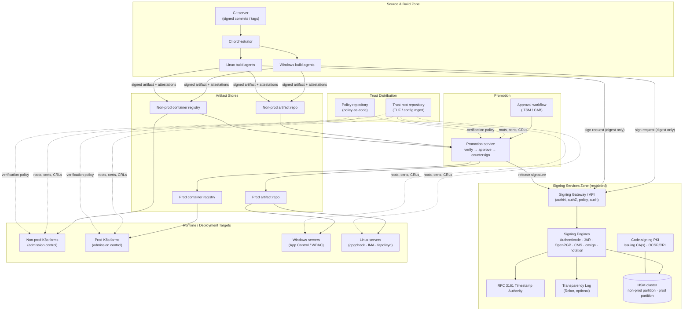
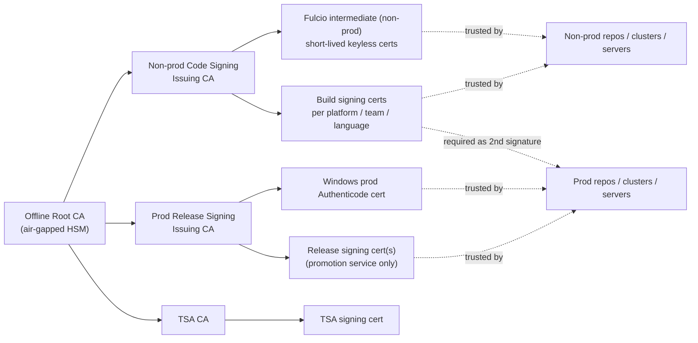
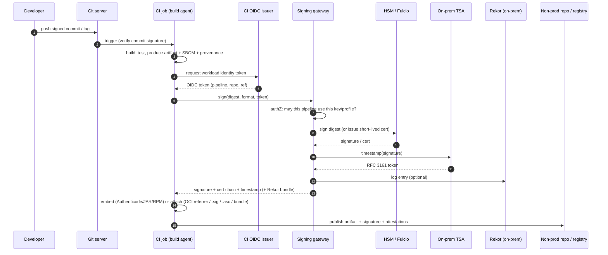
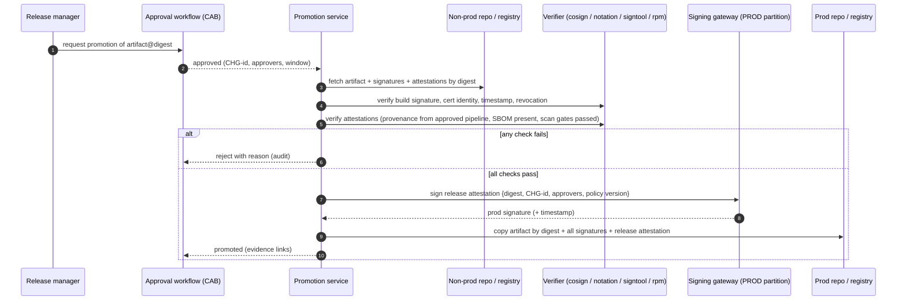
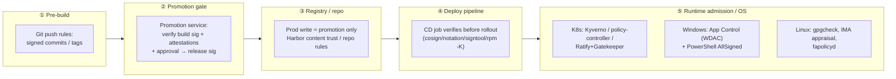

# Enterprise Artifact Signing & Signature Enforcement — Architecture Design

| | |
|---|---|
| **Document** | ECS-ARCH-01 — Artifact Signing & Verification Architecture |
| **Status** | Draft v0.1 |
| **Date** | 2026-10-03 |
| **Author** | James Fang |
| **Scope** | Signing and verification of source, build outputs, packages and container images produced by the on-premises CI/CD platform, and enforcement of signatures at promotion and deployment |
| **Out of scope** | End-to-end CI/CD pipeline design (separate document), SAST/SCA/DAST tooling, runtime threat detection |

---

## 1. Purpose

This document defines the target architecture for **code and artifact signing** on a self-hosted, on-premises CI/CD platform, and for **enforcing signature verification** before anything is promoted to production repositories or deployed to Windows servers, Linux servers and Kubernetes farms.

It:

1. Lists the artifact types to be signed and the signing format that fits each.
2. Describes the logical building blocks of a signing capability (key custody, signing service, timestamping, transparency, trust distribution, policy).
3. Sets out on-premises options — **open-source/free** and **commercial** — and hybrid options that use cloud services while keeping the ability to **operate disconnected** for a defined period.
4. Defines where and how signatures are verified and enforced (promotion gate, registry, Kubernetes admission, OS-level controls on servers).

## 2. Context and assumptions

| # | Assumption |
|---|---|
| A1 | CI/CD is self-hosted on premises (e.g. GitLab / Jenkins / Azure DevOps Server / Bamboo agents). Build agents run on Windows and Linux. |
| A2 | Languages: **C/C++, Java, Node.js, .NET**. Workloads run on **Windows servers, Linux servers** and **containers on multiple on-prem Kubernetes farms**. |
| A3 | Separate **non-production** and **production** artifact repositories (e.g. Nexus Repository Pro) and **non-prod / prod container registries**. |
| A4 | An **approval process** governs promotion of an artifact from non-prod to prod (change record / CAB / release manager). |
| A5 | The organisation must be able to keep building, promoting and deploying for a defined period (target: **≥ 7–30 days**, to be agreed) with **no connectivity to public cloud**. |
| A6 | Multiple jurisdictions (HK, UK); key custody and crypto choices must be justifiable to both. Crypto-agility (including future PQC) is a requirement, not an afterthought. |

## 3. Design principles

1. **Sign once, at the source of truth, with a short trust chain.** Artifacts are signed by the build platform immediately after they are produced — never by a developer workstation — and the signature travels with the artifact.
2. **Keys never leave hardware.** All long-lived private keys live in an HSM (or an HSM-backed KMS). Build agents never hold private keys; they call a signing service.
3. **Separate trust domains for non-prod and prod.** A non-prod signature must never be sufficient to run in production. Production trust is granted only by the promotion/approval step.
4. **Verify everywhere, enforce at choke points.** Verification is cheap; enforcement happens at (a) promotion into prod repositories, (b) Kubernetes admission, (c) server deployment/OS execution control.
5. **Verification must work offline.** Every verifier must be able to validate a signature using only locally-distributed trust material (roots, timestamps, revocation data). No deployment may depend on a cloud endpoint being reachable.
6. **Signatures are attestations, not just blobs.** Where tooling allows, sign *statements* about artifacts (provenance, SBOM, approval) using in-toto / SLSA formats, so policy can ask "who built this, from which commit, and who approved it?".
7. **Standards over products.** Prefer open formats (Authenticode, JAR signing, OpenPGP, CMS, Sigstore bundles, Notary Project / OCI referrers) so the key-custody product can be replaced without re-architecting verification.

## 4. What gets signed

### 4.1 Artifact inventory and signing formats

| Artifact | Example | Native / recommended signature format | Signing tool(s) | Native verifier |
|---|---|---|---|---|
| **Source commits & tags** | Git commits, release tags | OpenPGP, SSH or X.509 (gitsign / S/MIME) | `git -S`, gitsign, smimesign | Git server push rules, CI pre-build check |
| **Java libraries / apps** | `.jar`, `.war`, `.ear` | JAR signing (JCA, CMS inside `META-INF`) + detached `.asc` for Maven repos | `jarsigner` (PKCS#11), Maven Jarsigner plugin, Maven GPG plugin, Sigstore Maven plugin | `jarsigner -verify`, Maven `pgpverify` plugin |
| **.NET assemblies** | `.dll`, `.exe` | **Authenticode** (+ strong naming, which is identity not security) | `signtool`, AzureSignTool, osslsigncode, jsign | Windows (WDAC/App Control), `signtool verify` |
| **NuGet packages** | `.nupkg` | NuGet author / repository signatures (CMS) | `dotnet nuget sign`, `nuget sign` | `dotnet nuget verify`, `signatureValidationMode=require` + trusted signers |
| **Node.js packages** | `.tgz` | No usable offline-native npm signature for private registries → **detached signature / Sigstore bundle** over the tarball + provenance attestation | `cosign sign-blob`, `notation` blob signing, OpenPGP | `cosign verify-blob`, custom npm install hook / promotion gate |
| **C/C++ Windows binaries** | `.exe`, `.dll`, `.sys`, `.msi` | **Authenticode** (kernel drivers additionally need Microsoft attestation signing) | `signtool`, jsign, osslsigncode | Windows WDAC/App Control, SmartScreen |
| **C/C++ Linux binaries & packages** | ELF, `.rpm`, `.deb`, `.so` | RPM header signatures (OpenPGP), Debian repo `Release` signing, IMA file signatures, detached signatures for raw tarballs | `rpmsign`, `debsigs`/repo signing (`aptly`, `reprepro`), `evmctl`, cosign/OpenPGP | `rpm -K` / `gpgcheck=1`, apt secure, IMA appraisal, fapolicyd |
| **Scripts** | PowerShell, shell, Python | Authenticode for PowerShell; detached signature for others | `Set-AuthenticodeSignature`, cosign/OpenPGP | PowerShell `AllSigned` execution policy, WDAC |
| **Container images** | OCI images, Helm charts (OCI) | **Sigstore (cosign)** or **Notary Project (notation)** signatures stored as OCI referrers | `cosign`, `notation` | Kyverno, Sigstore policy-controller, Ratify + Gatekeeper, Harbor, CRI-O/Podman `policy.json` |
| **Attestations** | SBOM (CycloneDX/SPDX), SLSA provenance, test/scan results, approval record | **in-toto attestation in DSSE envelope** | `cosign attest`, `witness`, in-toto, `notation` (signed referrers) | Kyverno `verifyImages.attestations`, policy-controller, OPA/Rego |
| **Infrastructure-as-code & manifests** | Helm, Kustomize, Terraform modules | Sigstore bundle / OpenPGP / Git tag signing | cosign, Flux/Argo CD signature verification | Flux OCI verification, Argo CD GPG verification |

### 4.2 Two layers of signature

Every production artifact carries **two classes of signature**:

| Layer | Who signs | Key | Meaning | Who trusts it |
|---|---|---|---|---|
| **Build signature** | CI platform (build identity) | Non-prod / build signing key | "This artifact was produced by our trusted build system from commit X" | Non-prod repos, non-prod clusters, promotion gate |
| **Release (promotion) signature / attestation** | Promotion service, after approval | **Production release key** (separate HSM partition) | "This exact digest was approved for production under change CHG-nnn" | Prod repos, prod clusters, prod servers |

For formats that only support one embedded signature (Authenticode, JAR) the options are: (a) dual Authenticode signatures (supported — nested signatures), (b) re-sign at promotion with the production certificate, or (c) keep the embedded signature as the build signature and record the production approval as a **detached attestation** on the digest. Option (c) is recommended for containers and Linux packages; option (b) is recommended for Windows binaries that WDAC must trust (see §9.3).

## 5. Logical architecture — building blocks

### 5.1 Building block responsibilities

| Block | Responsibility | Key design decisions |
|---|---|---|
| **HSM cluster** | Generates and holds all private keys; performs signing operations. | FIPS 140-3 L3 (or 140-2 L3). **Separate partitions / key policies** for non-prod and prod. M-of-N quorum for prod key administration. HA pair per data centre + backup HSM. |
| **Code-signing PKI** | Issues X.509 code-signing certs (Authenticode, JAR, NuGet, notation, Fulcio intermediate). | Offline root; online issuing CA per trust domain (non-prod, prod). Short-ish validity (1–3 yrs) + timestamping. Publish CRL/OCSP **internally**. EKU = Code Signing (1.3.6.1.5.5.7.3.3). |
| **Signing gateway** | Single API for all signing; enforces *who may sign what with which key*. | Authenticates build jobs with workload identity (OIDC tokens from CI, mTLS, or Kerberos/AD for Windows agents). Only **hashes** are sent, never full artifacts, where the format permits (client-side hashing via PKCS#11/KSP/JCA proxy). Full audit log to SIEM. |
| **Signing engines** | Format-specific signers. | Prefer tools that use the native client (signtool via KSP/CSP, jarsigner via PKCS#11, gpg via PKCS#11/agent) so artifacts are bit-identical to industry-standard signing. |
| **Timestamp Authority (TSA)** | RFC 3161 timestamps so signatures remain valid after cert expiry / revocation-from-date. | **Must be on-prem** to meet the offline requirement. Own TSA cert chain; optionally dual-timestamp with a public TSA when online. |
| **Transparency log** | Append-only, publicly-verifiable record of every signature (Sigstore Rekor). | Optional but strongly recommended for detection of key misuse. Self-hosted only (never publish internal artifact metadata to public Rekor). |
| **Trust root repository** | Distributes verification material to every verifier. | Use **TUF** (Sigstore `trusted_root.json`) for containers; config management (GPO/Intune, Ansible/Puppet) for OS-level trust stores. Versioned and signed. |
| **Policy repository** | Policy-as-code: which identities/keys are trusted for which environment/namespace/artifact. | Git-backed, reviewed, signed; rendered into Kyverno/Gatekeeper policies, `policy.json`, WDAC policies, promotion rules. |
| **Promotion service** | Verifies build signature + attestations, checks approval, applies release signature, copies to prod repo. | The **only** identity with write access to prod repos/registries. Idempotent, digest-pinned. |

## 6. Trust model

**Rules**

- Production verifiers trust **only** the Prod Release Signing CA (and, as a second required signature, the build CA identity bound to an approved pipeline). Non-prod verifiers trust both.
- Certificates encode identity in SANs / OIDs: pipeline, repository, branch, team. Policy matches on these (e.g. "image must be signed by `pipeline=payments/*` on `refs/heads/main`").
- Keyless (Sigstore Fulcio) issuance is bound to the CI's **OIDC workload identity**; certs live ~10 minutes, so there is no long-lived build key to steal from an agent.
- Revocation: CRLs published internally and mirrored to all zones; for keyless, revocation = remove identity from policy + Rekor search for misuse.

## 7. Signing capability options

### 7.1 Option summary

| # | Option | Type | Covers | Strengths | Weaknesses |
|---|---|---|---|---|---|
| **O1** | **Self-hosted Sigstore** (Fulcio, Rekor, CT log, TSA, TUF — via `scaffolding` / Helm / RHTAS) | Open source (Red Hat Trusted Artifact Signer = supported distribution) | Containers, blobs (npm tgz, zips), attestations, Git (gitsign), Maven | Keyless, short-lived certs; transparency log; first-class K8s policy support; strong ecosystem | Doesn't do Authenticode/JAR/RPM natively; operating Rekor/Trillian + DB needs SRE maturity |
| **O2** | **Notary Project (notation)** + plugin to KMS/HSM | Open source (CNCF) | Containers, OCI artifacts, blobs | X.509-native (fits enterprise PKI), plugins for HSM/Vault/cloud KMS, Ratify/Kyverno verification, timestamp support | No transparency log; ecosystem smaller than cosign |
| **O3** | **Keyfactor SignServer CE** (+ EJBCA CE for PKI) | Open source (LGPL); Enterprise edition paid | Authenticode, JAR, MSI, CMS, OpenPGP, RPM/deb (OpenPGP), XAdES/PDF, **TSA** | One server covers almost every legacy format incl. RFC 3161 TSA; client-side hashing; PKCS#11 to HSM | CE lacks some enterprise features (HA tooling, support); containers via OpenPGP/CMS, not cosign |
| **O4** | **HashiCorp Vault / OpenBao** Transit + PKI engines | OSS (OpenBao) / paid (Vault Ent with HSM seal, managed keys) | Raw sign operations, PKI issuance, cosign (`hashivault://` KMS), notation plugin | Good API & identity integration (OIDC, AD, K8s auth); fits existing secrets platform | Not a format-aware signer (Authenticode/JAR need glue); keys in software unless Enterprise + HSM-managed keys |
| **O5** | **GnuPG + HSM / smartcard, signtool + KSP, jarsigner + PKCS#11** run on a hardened signing host | Free | Every native format | Simplest; no new platform | Weak governance (who signed what), poor scale, key access is coarse; acceptable only as interim |
| **C1** | **CyberArk (Venafi) CodeSign Protect** | Commercial, on-prem | Authenticode, JAR, GPG, Apple, cosign/notation, Docker, RPM; client-side hashing via KSP/CSP/PKCS#11 | Mature policy, approvals, per-project key access, broad format support, works with any HSM | Licence cost; product direction post-acquisition to watch |
| **C2** | **Keyfactor Signum / SignServer Enterprise + EJBCA Enterprise** | Commercial, on-prem or SaaS | All SignServer formats + Windows-native KSP client, workflow, HA | Same engine as O3 with support → **clean OSS-to-paid upgrade path**; strong PKI | Licence; Signum is primarily SaaS-delivered — confirm on-prem deployment scope |
| **C3** | **DigiCert Software Trust Manager** | Commercial; cloud or **on-prem/private deployment** | Authenticode, JAR, GPG, RPM, containers, KeyLocker HSM | Unified with public code-signing certs (needed for externally distributed software); threat detection on signatures | Primarily SaaS; verify on-prem appliance model and disconnected behaviour |
| **C4** | **Garantir GaraTrust**, **Fortanix DSM**, **Entrust (nShield) Signing Automation**, **Thales CipherTrust / Luna + partner signers** | Commercial | Varies; all provide client-side-hash signing to HSM-held keys | Fortanix DSM supports on-prem, SaaS and **hybrid** clusters; HSM vendors give strong key custody | Mostly key-custody-centric — still need format tooling and policy |
| **CL1** | **Azure Artifact (Trusted) Signing**, **Azure Key Vault / Managed HSM** | Cloud | Authenticode (Trusted Signing); generic sign via AKV (notation, cosign, AzureSignTool) | Low ops; Microsoft-managed CA trusted by Windows | **Online at signing time** (Trusted Signing certs live ~3 days); data-residency questions |
| **CL2** | **AWS Signer**, **AWS KMS / CloudHSM** | Cloud | Containers (notation plugin), Lambda, generic sign via KMS | Managed lifecycle and revocation; notation plugin | Online at signing time; revocation check online unless cached |
| **CL3** | **Google Cloud KMS / Cloud HSM** | Cloud | Generic sign (cosign `gcpkms://`, notation plugin, jsign) | Ties into existing GCP landing zone | Online at signing time |

### 7.2 HSM options (key custody for all on-prem options)

| HSM | Type | Notes |
|---|---|---|
| Thales Luna Network HSM 7 | Commercial | Partitions per trust domain, M-of-N, PKCS#11/KSP/JCA — broadest signer integration |
| Entrust nShield Connect / 5 | Commercial | Security World model, CodeSafe; strong Authenticode/KSP support |
| Utimaco SecurityServer / u.trust GP | Commercial | Good value; PKCS#11; used widely with EJBCA/SignServer |
| Fortanix DSM (on-prem appliance) | Commercial | HSM + KMS + API in one; hybrid clustering with SaaS |
| YubiHSM 2 / Nitrokey HSM 2 | Low cost | Suitable for **offline root CA** or lab; not for high-throughput CI signing |
| SoftHSM2 | Free (software) | **Dev/test only** — never for production keys |

### 7.3 Candidate reference stacks

| Stack | Composition | Fit |
|---|---|---|
| **A — Open-source first** | EJBCA CE (PKI) + **SignServer CE** (Authenticode/JAR/NuGet/RPM/OpenPGP + TSA) + **self-hosted Sigstore** (containers, blobs, attestations, keyless) + **OpenBao** for workload auth/secrets + HSM (Utimaco/Luna/nShield) + **Kyverno** (K8s) + WDAC / gpgcheck / IMA | Lowest licence cost; highest engineering/ops effort; good if the platform team already runs K8s operators and PKI |
| **B — Commercial core** | **CyberArk CodeSign Protect** *or* **Keyfactor SignServer Enterprise + EJBCA Enterprise** + Luna/nShield HSM + **notation** (X.509) for containers + **Ratify/Kyverno** + WDAC | Lowest risk; strongest governance/approval UX; best when auditors need vendor support and RACI |
| **C — Hybrid (recommended starting point)** | Commercial or SignServer Enterprise for *native formats* (Authenticode/JAR/NuGet/RPM) + **Red Hat Trusted Artifact Signer or self-hosted Sigstore** for containers & attestations + on-prem HSM + on-prem TSA; **optional cloud KMS** only as escrow/DR and for externally published artifacts | Uses best-in-class tooling per artifact class; one PKI and one HSM estate; cloud dependency removed from the critical path |

**Recommendation (for evaluation):** adopt **Stack C**, starting with the open-source components (SignServer CE, Sigstore, Kyverno) in a pilot, with a pre-agreed path to **SignServer Enterprise / CodeSign Protect** for production governance and support. Decide after a 6–8 week proof of concept against the criteria in §12.

## 8. Signing flows

### 8.1 Build-time signing (all artifact types)

### 8.2 Per-technology notes

| Tech | Build-time signing approach |
|---|---|
| **Java** | Sign JARs with `jarsigner -storetype PKCS11` (or Maven Jarsigner plugin pointed at the signing gateway's PKCS#11 provider), always with `-tsa https://tsa.internal`. Also publish detached `.asc` (OpenPGP) or Sigstore bundles for Maven repository consumers. |
| **.NET** | `signtool sign /fd sha256 /tr https://tsa.internal /td sha256` using a KSP that proxies to the gateway (CodeSign Protect, SignServer KSP, Fortanix, Garantir). Then `dotnet nuget sign` for packages. Keep strong-name keys in the HSM too. |
| **Node.js** | `npm pack` → `cosign sign-blob --bundle pkg.sigstore.json pkg.tgz` (or notation blob sign) + `cosign attest-blob` with SLSA provenance and CycloneDX SBOM. Store bundle next to the tarball in the repo (sidecar asset). |
| **C/C++ Windows** | Authenticode as for .NET (PE, MSI, CAB, drivers). Sign **every** PE file inside installers, then the installer. |
| **C/C++ Linux** | `rpmsign --addsign` with the OpenPGP key in the HSM (via gpg-agent PKCS#11 / SignServer OpenPGP worker); sign apt/yum **repository metadata** at the repo; optionally `evmctl ima_sign` file signatures for IMA appraisal. |
| **Containers** | Build → push to non-prod registry **by digest** → `cosign sign` (keyless via on-prem Fulcio or HSM-backed key) **or** `notation sign` (X.509 via HSM plugin) → `cosign attest` provenance/SBOM/vuln scan. Never sign by tag. |
| **Helm / manifests** | Push charts as OCI artifacts and sign like images; sign Git tags for GitOps sources. |

### 8.3 Promotion (non-prod → prod) flow

Controls:

- Prod repos/registries accept writes **only** from the promotion service identity.
- Promotion is by **digest**; the bits are never rebuilt. (For Windows binaries needing a prod Authenticode cert, the promotion service re-signs, re-verifies and records both digests in the release attestation.)
- Repository-level checks (e.g. Harbor "prevent unsigned images", Nexus/Artifactory webhooks or staging-repo rules) are **defence in depth**; the authoritative check is the promotion service, because not all repository products verify signatures natively.

## 9. Enforcement at deployment

### 9.1 Enforcement points overview

The **deploy pipeline check (④)** gives fast, readable feedback; the **runtime control (⑤)** is the one that cannot be bypassed by someone with `kubectl` or RDP. Both are required.

### 9.2 Kubernetes (multiple farms)

| Option | Type | Sig formats | Notes |
|---|---|---|---|
| **Kyverno** `verifyImages` | OSS (CNCF) | cosign (key, keyless, attestations), notation | Policy in YAML; can **mutate tag → digest**; supports offline Rekor/TUF config; widely adopted |
| **Sigstore policy-controller** | OSS | cosign, attestations (CUE/Rego) | Namespace opt-in; native custom TUF root / private Rekor |
| **Ratify + OPA Gatekeeper** | OSS (CNCF) | notation, cosign, SBOM/vuln referrers | Best for notation/X.509 estates; Gatekeeper may already be deployed |
| **CRI-O / containerd image policy** (`policy.json`, `sigstoreSigned`) | OSS | cosign/sigstore, simple signing | Node-level backstop (OpenShift uses this); harder to manage at scale |
| **Commercial**: Red Hat ACS, Prisma Cloud, Aqua, Sysdig, Wiz admission | Paid | cosign/notation | Adds UI/reporting; usually wraps the same verification |

Design:

- One **policy bundle** rendered from the policy repository, deployed to every farm by GitOps. Farms differ only by environment label (non-prod/prod) which selects the trust root and required signatures.
- **Prod policy:** image must come from the prod registry, be referenced by digest, carry a valid **release signature** from the Prod Release CA, and a **build attestation** from an approved pipeline identity.
- **Non-prod policy:** image from non-prod or prod registry, build signature required.
- Admission webhooks run HA (≥3 replicas, PDBs), with **fail-closed** for prod namespaces and an explicit, audited break-glass procedure (time-boxed exception policy signed by security).
- Verification uses locally mounted trust material (TUF root, CA bundle, Rekor public key, TSA chain) — no outbound calls.
- System namespaces (kube-system, CNI, the policy engine itself) are covered by a separate policy with a narrow allow-list — not exempted wholesale.

### 9.3 Windows servers

| Control | Purpose |
|---|---|
| **App Control for Business (WDAC)** policy trusting the **Prod Authenticode CA / publisher** (signer rules, not hash rules) | Only prod-signed binaries/DLLs/scripts run; managed by GPO/Intune/ConfigMgr; start in audit mode |
| **PowerShell execution policy `AllSigned`** + Constrained Language Mode under WDAC | Prevent unsigned script execution |
| **Deployment tooling check** (e.g. Octopus/Ansible/PowerShell DSC step runs `signtool verify /pa /all` and `Get-AuthenticodeSignature`) | Fail deployment early with a clear message |
| **NuGet** `signatureValidationMode=require` + `trustedSigners` | Only prod-signed packages restore on prod build/deploy hosts |
| AppLocker (fallback) | Where WDAC is not feasible (legacy OS) |

### 9.4 Linux servers

| Control | Purpose |
|---|---|
| **`gpgcheck=1` / `repo_gpgcheck=1`** (yum/dnf) and signed apt `Release` | Packages only install if signed by the prod repo key |
| **fapolicyd** (RHEL) | Allow execution only of files from trusted (RPM-database) sources |
| **IMA/EVM appraisal** with the prod IMA key in the kernel keyring | Kernel refuses to execute unsigned/modified files (strong, higher effort — pilot on high-value hosts) |
| **Deployment tooling check** (`rpm -K`, `cosign verify-blob`, `gpg --verify`) | Fail deployment early for tarball/zip-delivered apps |
| Java runtime | `jarsigner -verify -strict` in deployment step; (Java Security Manager is deprecated — do not rely on it) |

## 10. Cloud services with disconnected operation

The requirement is to be able to use cloud services (e.g. for key escrow, managed CA, externally trusted certificates) **without** making builds, promotions or deployments depend on cloud availability.

### 10.1 What must work offline

| Function | Offline requirement | How |
|---|---|---|
| **Verification** (promotion, admission, servers) | **Always**, indefinitely | Local trust roots; RFC 3161 timestamps from on-prem TSA; locally-published CRL/OCSP with long enough `nextUpdate`; Sigstore bundles with embedded inclusion proofs / signed entry timestamps; cached TUF metadata with expiry ≥ outage window |
| **Build signing** | For the agreed outage window (e.g. 30 days) | Signing keys/certs usable from on-prem HSM; on-prem Fulcio/Rekor/TSA |
| **Promotion signing** | For the agreed outage window | Prod release key in on-prem HSM |
| **Key/cert lifecycle** (issue new certs, rotate) | May pause during outage | Cloud or on-prem CA; pre-issue certificates with overlap |

### 10.2 Hybrid patterns

| Pattern | Description | Disconnected behaviour | Trade-offs |
|---|---|---|---|
| **H1 — On-prem live keys, cloud as escrow/DR** | Keys generated in on-prem HSM, wrapped and backed up to cloud KMS / Managed HSM (BYOK), or vice versa (HYOK) | Full operation offline; cloud only used to restore | Key-export policy must be approved; dual-jurisdiction custody questions (HK/UK) |
| **H2 — Cloud root, on-prem subordinate** | Offline or cloud-hosted root CA; issuing CAs and signing keys on-prem with long-enough validity | Full operation offline until subordinate cert expiry (years) | Root ceremonies needed when online; CRLs signed on-prem |
| **H3 — Hybrid HSM cluster** (e.g. Fortanix DSM hybrid, Thales CipherTrust + Luna) | Same key material replicated between on-prem nodes and SaaS nodes under vendor sync | On-prem nodes continue signing when cloud link is down | Vendor-specific; validate failure modes in PoC |
| **H4 — Signing lease / pre-issued certs** | When connected, the on-prem signer obtains a cert for an on-prem-generated key from a cloud CA (e.g. 30–90-day validity) | Signs offline until lease expiry; renew on reconnect | Must size lease ≥ outage window; short-lived certs (e.g. Azure Trusted Signing ~72 h) **do not** meet a multi-day window |
| **H5 — Store-and-forward for public-trust signing** | Internal builds signed on-prem immediately; artifacts that need **public** trust (customer-facing installers) queued for cloud signing when connected | Internal operation unaffected; external releases delayed | Two signatures per external artifact; clear policy on which is required where |
| **H6 — Sigstore with cached trust** | Self-hosted Sigstore; optional mirroring of public Sigstore TUF root for OSS dependency verification | Verification offline using cached TUF (watch metadata expiry); signing needs only on-prem Fulcio/Rekor | Public TUF metadata expires — set refresh cadence and alerting |

**Key point:** cloud *signing* services that require an online call per signature (Azure Trusted Signing, AWS Signer, cloud KMS `sign`) can only be used where an outage of the cloud link is acceptable (H5). Anything on the critical path must use **H1–H4**.

## 11. Security controls & operations

| Area | Control |
|---|---|
| **Access to keys** | Per-key ACLs bound to pipeline identity (repo + branch + environment). No human interactive signing for prod except break-glass with M-of-N. |
| **Build integrity** | Ephemeral, isolated build agents; protected branches; signed commits; provenance (SLSA L2 → L3 target) generated by the platform, not the job. |
| **Separation of duties** | Platform team ≠ key custodians ≠ release approvers. Promotion service code changes require security review. |
| **Audit** | Every sign request (who, what digest, which key, result) → SIEM; daily reconciliation of Rekor / signing logs vs. artifacts in prod repos; alert on signatures with no matching build. |
| **Key rotation** | Build keys / certs: ≤ 1–2 years (keyless: minutes). Release keys: 2–3 years with overlap. Roots: 10–20 years, offline. Timestamps keep historical signatures valid. |
| **Compromise response** | Runbook: revoke cert (CRL), remove identity from policy, query transparency/audit logs for all signatures by that key since T₀, re-sign affected artifacts, redeploy. Exercise annually. |
| **Crypto-agility / PQC** | Abstract algorithms behind the gateway; track ML-DSA (FIPS 204) / SLH-DSA (FIPS 205) support in HSMs, Authenticode, JAR, Sigstore and notation; include signing keys in the CBOM inventory. Default today: ECDSA P-256/P-384 or RSA-3072+ with SHA-256/384. |
| **Availability** | Signing gateway and TSA HA in each DC; HSM HA pair per DC; admission controllers HA per farm; signing outages fail builds (never fall back to unsigned). |

## 12. Evaluation criteria for PoC

| Criterion | Weight | Questions |
|---|---|---|
| Format coverage | High | Authenticode (PE/MSI/PS1), JAR, NuGet, RPM/deb, OpenPGP, cosign, notation, in-toto attestations? |
| Client-side hashing / no key export | High | Can large artifacts be signed without uploading them? Native KSP/PKCS#11/JCA clients? |
| Identity & policy | High | Bind keys to CI workload identity (OIDC), per-project ACLs, approval workflows? |
| Offline operation | High | Behaviour with no cloud link for 30 days; TSA on-prem; CRL/OCSP local? |
| HSM integration | High | Supported HSMs, partitions, quorum, HA |
| K8s enforcement fit | High | Works with Kyverno / Ratify / policy-controller across multiple farms |
| Windows/Linux enforcement fit | Medium | WDAC publisher rules, RPM/apt, IMA |
| Operability | Medium | HA, upgrades, monitoring, backup/restore, DR |
| Audit & reporting | Medium | SIEM integration, evidence for auditors |
| Cost (licence + run) | Medium | Per-key / per-signature / per-node pricing; ops FTE for OSS |
| Vendor/jurisdiction | Medium | Support in HK and UK; data residency; export-control considerations |

## 13. Roadmap (indicative)

| Phase | Duration | Outcomes |
|---|---|---|
| **0 — Foundations** | 0–3 months | HSM procurement; offline root CA ceremony; on-prem TSA; policy repo; PoC of Stack C |
| **1 — Containers first** | 2–5 months | Sigstore/notation signing in CI; Kyverno in **audit** on all farms; promotion service for images; prod registry write-locked |
| **2 — Native formats** | 4–8 months | Authenticode, JAR, NuGet, RPM signing via signing gateway; WDAC audit mode on pilot servers; `gpgcheck` everywhere |
| **3 — Enforce** | 6–10 months | Kyverno **enforce** on prod farms; WDAC enforce on prod Windows; promotion service mandatory for all prod repos |
| **4 — Attestations & hardening** | 9–12+ months | SLSA provenance gates, SBOM/vuln attestations in policy, IMA on high-value Linux hosts, PQC readiness review |

## 14. Open decisions

| # | Decision | Options | Owner |
|---|---|---|---|
| D1 | Container signature standard | cosign (Sigstore) vs notation (Notary Project) vs both | Architecture |
| D2 | Native-format signing platform | SignServer CE → Enterprise vs CyberArk CodeSign Protect vs DigiCert STM | Security / Procurement |
| D3 | HSM vendor | Luna vs nShield vs Utimaco vs Fortanix | Security |
| D4 | Maximum disconnected window | 7 / 30 / 90 days | Risk / BCM |
| D5 | Windows prod trust | Re-sign at promotion with prod cert vs dual Authenticode signatures | Architecture / Windows platform |
| D6 | Transparency log | Self-hosted Rekor required vs optional | Security |
| D7 | K8s admission engine | Kyverno vs policy-controller vs Ratify + Gatekeeper | Platform |

## 15. Glossary

| Term | Meaning |
|---|---|
| **Attestation** | Signed statement about an artifact (provenance, SBOM, approval), typically in-toto in a DSSE envelope |
| **Authenticode** | Microsoft's code-signing format for PE files, MSI, scripts |
| **cosign / Sigstore** | Signing tool and ecosystem (Fulcio CA, Rekor log, TUF trust root) for containers and blobs |
| **notation / Notary Project** | CNCF X.509-based signing standard for OCI artifacts |
| **OCI referrers** | Registry API to attach signatures/SBOMs to an image digest |
| **RFC 3161 TSA** | Trusted timestamping service proving a signature existed before a certificate expired or was revoked |
| **TUF** | The Update Framework — secure distribution of trust roots and metadata |
| **WDAC / App Control for Business** | Windows application allow-listing based on signer, path or hash |
| **IMA/EVM** | Linux kernel integrity subsystem able to enforce file signatures at execution |
| **SLSA** | Supply-chain Levels for Software Artifacts — provenance maturity framework |
