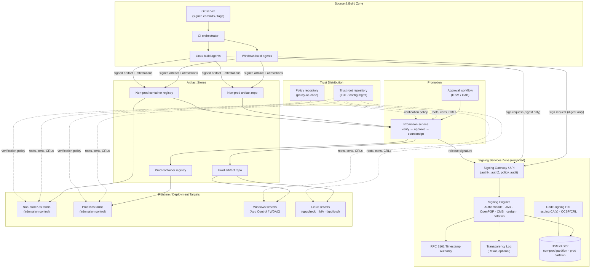
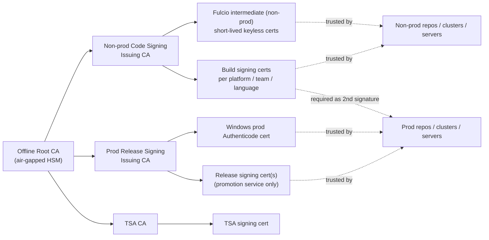
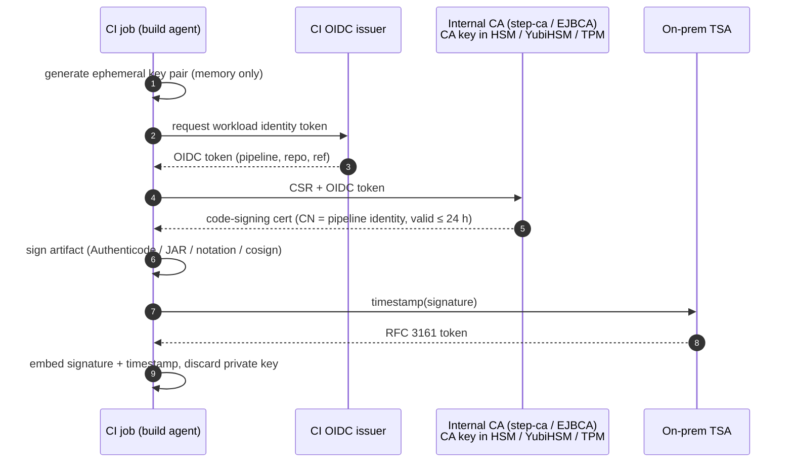
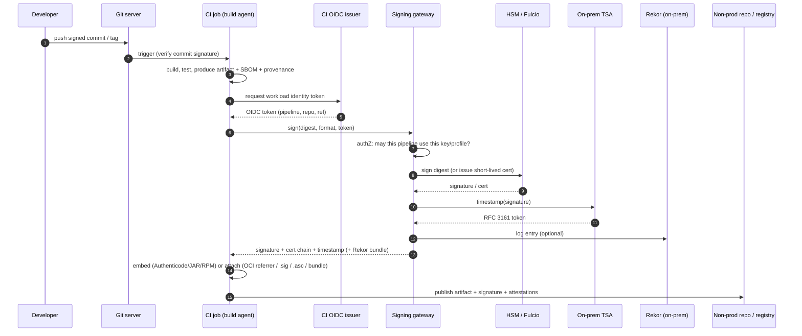
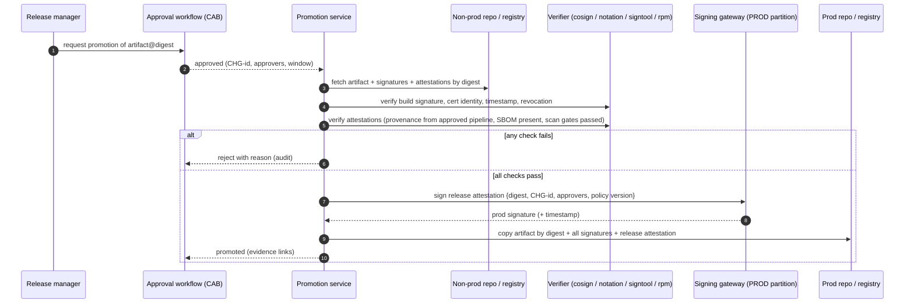
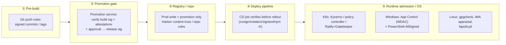
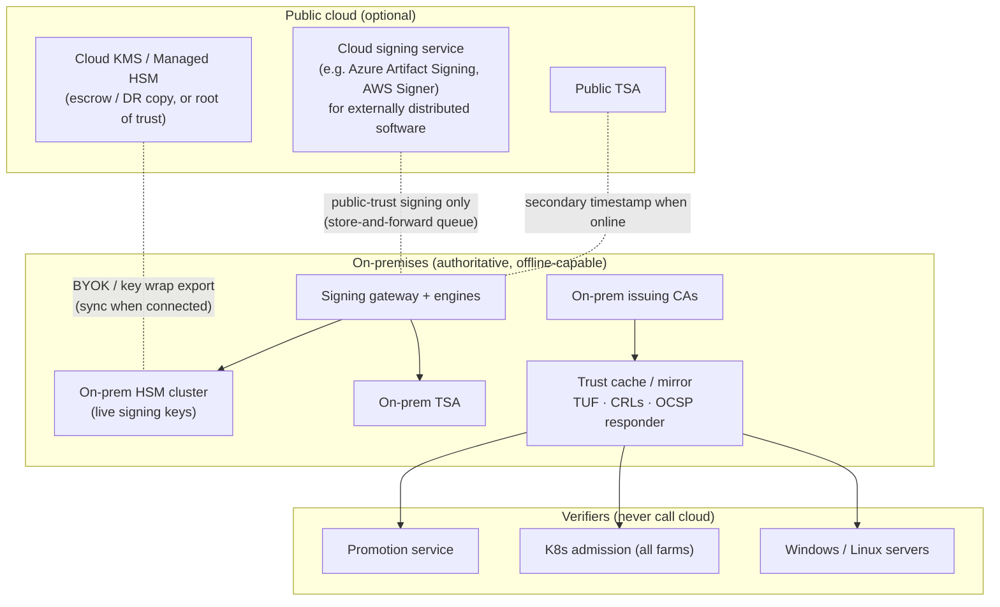

# Enterprise Artifact Signing & Signature Enforcement — Architecture Design

| | |
|---|---|
| **Document** | ECS-ARCH-01 — Artifact Signing & Verification Architecture |
| **Status** | Draft v0.2 |
| **Date** | 2026-10-03 |
| **Author** | James Fang |
| **Scope** | Signing and verification of source, build outputs, packages and container images produced by the on-premises CI/CD platform, and enforcement of signatures at promotion and deployment |
| **Out of scope** | End-to-end CI/CD pipeline design (separate document), SAST/SCA/DAST tooling, runtime threat detection |

**Revision history**

| Version | Date | Change |
|---|---|---|
| v0.1 | 2026-10-03 | Initial draft |
| v0.2 | 2026-10-03 | Added Microsoft Artifact Signing usage and disconnected-operation analysis (§7.4), Huawei Cloud Stack key services (§7.5), open-source bill of materials (§7.6), lightweight key custody and short-lived certificate pattern (§7.7), easiest self-hosted options (§7.8). Updated options O1, O3, O4, C1, C2, CL1 and pattern H4 for current product state. Added sources for factual statements (Appendix A) and PoC verification items (Appendix B). |

Citations in the form \[[MS2]\] link to the sources listed in [Appendix A](#appendix-a--sources). Statements of design intent, principles and recommendations are the author's and are not cited.

---

## 1. Purpose

This document defines the target architecture for **code and artifact signing** on a self-hosted, on-premises CI/CD platform, and for **enforcing signature verification** before anything is promoted to production repositories or deployed to Windows servers, Linux servers and Kubernetes farms.

It:

1. Lists the artifact types to be signed and the signing format that fits each.
2. Describes the logical building blocks of a signing capability (key custody, signing service, timestamping, transparency, trust distribution, policy).
3. Sets out on-premises options — **open-source/free** and **commercial** — and hybrid options that use cloud services while keeping the ability to **operate disconnected** for a defined period.
4. Defines where and how signatures are verified and enforced (promotion gate, registry, Kubernetes admission, OS-level controls on servers).

## 2. Context and assumptions

| # | Assumption |
|---|---|
| A1 | CI/CD is self-hosted on premises (e.g. GitLab / Jenkins / Azure DevOps Server / Bamboo agents). Build agents run on Windows and Linux. |
| A2 | Languages: **C/C++, Java, Node.js, .NET**. Workloads run on **Windows servers, Linux servers** and **containers on multiple on-prem Kubernetes farms**. |
| A3 | Separate **non-production** and **production** artifact repositories (e.g. Nexus Repository Pro) and **non-prod / prod container registries**. |
| A4 | An **approval process** governs promotion of an artifact from non-prod to prod (change record / CAB / release manager). |
| A5 | The organisation must be able to keep building, promoting and deploying for a defined period (target: **≥ 7–30 days**, to be agreed) with **no connectivity to public cloud**. |
| A6 | Multiple jurisdictions (HK, UK); key custody and crypto choices must be justifiable to both. Crypto-agility (including future PQC) is a requirement, not an afterthought. |
| A7 | The on-premises private cloud may be **Huawei Cloud Stack (HCS)**. Its native key services (Data Encryption Workshop — KMS, Dedicated HSM, secrets manager) are evaluated as key-custody options in §7.5. |

## 3. Design principles

1. **Sign once, at the source of truth, with a short trust chain.** Artifacts are signed by the build platform immediately after they are produced — never by a developer workstation — and the signature travels with the artifact.
2. **Keys never leave hardware.** All long-lived private keys live in an HSM (or an HSM-backed KMS). Build agents never hold long-lived private keys; they call a signing service. (Ephemeral per-job keys bound to short-lived certificates are permitted — see §7.7.)
3. **Separate trust domains for non-prod and prod.** A non-prod signature must never be sufficient to run in production. Production trust is granted only by the promotion/approval step.
4. **Verify everywhere, enforce at choke points.** Verification is cheap; enforcement happens at (a) promotion into prod repositories, (b) Kubernetes admission, (c) server deployment/OS execution control.
5. **Verification must work offline.** Every verifier must be able to validate a signature using only locally-distributed trust material (roots, timestamps, revocation data). No deployment may depend on a cloud endpoint being reachable.
6. **Signatures are attestations, not just blobs.** Where tooling allows, sign *statements* about artifacts (provenance, SBOM, approval) using in-toto / SLSA formats, so policy can ask "who built this, from which commit, and who approved it?".
7. **Standards over products.** Prefer open formats (Authenticode, JAR signing, OpenPGP, CMS, Sigstore bundles, Notary Project / OCI referrers) and standard key interfaces (PKCS#11, KSP/CNG, JCA) so the key-custody product can be replaced without re-architecting verification.

## 4. What gets signed

### 4.1 Artifact inventory and signing formats

| Artifact | Example | Native / recommended signature format | Signing tool(s) | Native verifier |
|---|---|---|---|---|
| **Source commits & tags** | Git commits, release tags | OpenPGP, SSH or X.509 (gitsign / S/MIME) \[[GIT1], [GIT2]\] | `git -S`, gitsign, smimesign | Git server push rules, CI pre-build check |
| **Java libraries / apps** | `.jar`, `.war`, `.ear` | JAR signing + detached `.asc` for Maven repos \[[JV1]\] | `jarsigner` with PKCS#11 \[[JV1], [JV2]\], Maven Jarsigner plugin \[[JV3]\], Maven GPG plugin \[[JV4]\], Sigstore Maven plugin \[[JV5]\] | `jarsigner -verify` \[[JV1]\], `pgpverify` Maven plugin \[[JV6]\] |
| **.NET assemblies** | `.dll`, `.exe` | **Authenticode** \[[WIN10]\] (+ strong naming, which gives identity, not security \[[WIN15]\]) | `signtool` \[[WIN10]\], AzureSignTool \[[MS23]\], osslsigncode \[[TL2]\], Jsign \[[TL1]\] | Windows App Control \[[WIN1]\], `signtool verify` \[[WIN10]\] |
| **NuGet packages** | `.nupkg` | NuGet author / repository signatures \[[NG3]\] | `dotnet nuget sign` \[[NG3]\], `nuget sign` | `dotnet nuget verify` \[[NG4]\], `signatureValidationMode=require` + `trustedSigners` \[[NG1], [NG2]\] |
| **Node.js packages** | `.tgz` | npm's registry signatures and provenance are produced by the registry and the publishing pipeline \[[NPM1], [NPM2]\]; private registries generally do not provide them (verify for the chosen product) → **detached signature / Sigstore bundle** over the tarball + provenance attestation | `cosign sign-blob` \[[SIG2]\], `notation` blob signing, OpenPGP | `cosign verify-blob` \[[SIG2]\], custom npm install hook / promotion gate |
| **C/C++ Windows binaries** | `.exe`, `.dll`, `.sys`, `.msi` | **Authenticode** (kernel drivers additionally need Microsoft signing, e.g. attestation signing \[[WIN13], [WIN14]\]) | `signtool`, Jsign, osslsigncode | Windows App Control, SmartScreen |
| **C/C++ Linux binaries & packages** | ELF, `.rpm`, `.deb`, `.so` | RPM header signatures (OpenPGP) \[[LNX1]\]; Debian **repository** signing (signed `Release`/`InRelease`) — apt authenticates the archive, not individual `.deb` files \[[LNX3], [LNX4]\]; IMA file signatures \[[LNX10]\]; detached signatures for raw tarballs | `rpmsign` \[[LNX1]\], repo signing with `aptly` \[[LNX5]\] / `reprepro` \[[LNX6]\] / Pulp \[[LNX7]\], `evmctl` \[[LNX11]\], cosign/OpenPGP | `rpm -K` / `gpgcheck=1` \[[LNX2]\], apt secure \[[LNX4]\], IMA appraisal \[[LNX10]\], fapolicyd \[[LNX8]\] |
| **Scripts** | PowerShell, shell, Python | Authenticode for PowerShell; detached signature for others | `Set-AuthenticodeSignature` \[[WIN9]\], cosign/OpenPGP | PowerShell `AllSigned` \[[WIN6]\], App Control |
| **Container images** | OCI images, Helm charts (OCI) | **Sigstore (cosign)** or **Notary Project (notation)** signatures stored as OCI referrers \[[SIG1], [K8S1], [K8S21], [K8S22]\] | `cosign`, `notation` | Kyverno \[[K8S8]\], Sigstore policy-controller \[[SIG18]\], Ratify + Gatekeeper \[[K8S12], [K8S13]\], Harbor \[[K8S15]\], CRI-O/Podman `policy.json` \[[K8S14]\] |
| **Attestations** | SBOM (CycloneDX/SPDX), SLSA provenance, test/scan results, approval record | **in-toto attestation in DSSE envelope** \[[STD1], [STD2]\] | `cosign attest` \[[SIG4]\], `witness` \[[STD3]\], in-toto, `notation` (signed referrers) | Kyverno `verifyImages.attestations` \[[K8S8]\], policy-controller, OPA/Rego |
| **Infrastructure-as-code & manifests** | Helm, Kustomize, Terraform modules | Sigstore bundle / OpenPGP / Git tag signing | cosign, Flux/Argo CD signature verification | Flux OCI verification (cosign and notation) \[[K8S16]\]; Argo CD source integrity verification — its older GnuPG verification is deprecated \[[K8S17], [K8S18]\] |

### 4.2 Two layers of signature

Every production artifact carries **two classes of signature**:

| Layer | Who signs | Key | Meaning | Who trusts it |
|---|---|---|---|---|
| **Build signature** | CI platform (build identity) | Non-prod / build signing key | "This artifact was produced by our trusted build system from commit X" | Non-prod repos, non-prod clusters, promotion gate |
| **Release (promotion) signature / attestation** | Promotion service, after approval | **Production release key** (separate HSM partition) | "This exact digest was approved for production under change CHG-nnn" | Prod repos, prod clusters, prod servers |

For formats that only support one embedded signature (Authenticode, JAR) the options are: (a) dual Authenticode signatures (signtool `/as` appends a signature \[[WIN11]\]), (b) re-sign at promotion with the production certificate, or (c) keep the embedded signature as the build signature and record the production approval as a **detached attestation** on the digest. Option (c) is recommended for containers and Linux packages; option (b) is recommended for Windows binaries that App Control must trust (see §9.3).

## 5. Logical architecture — building blocks

### 5.1 Building block responsibilities

| Block | Responsibility | Key design decisions |
|---|---|---|
| **HSM cluster** | Generates and holds all private keys; performs signing operations. | FIPS 140-3 \[[STD9]\] Level 3 (or 140-2 L3). **Separate partitions / key policies** for non-prod and prod. M-of-N quorum for prod key administration. HA pair per data centre + backup HSM. Lighter-weight custody options are in §7.7. |
| **Code-signing PKI** | Issues X.509 code-signing certs (Authenticode, JAR, NuGet, notation, Fulcio intermediate). | Offline root; online issuing CA per trust domain (non-prod, prod). Short-ish validity (1–3 yrs) + timestamping. Publish CRL/OCSP **internally**. EKU = Code Signing, `id-kp-codeSigning` 1.3.6.1.5.5.7.3.3 \[[STD8]\]. |
| **Signing gateway** | Single API for all signing; enforces *who may sign what with which key*. | Authenticates build jobs with workload identity (OIDC tokens from CI, mTLS, or Kerberos/AD for Windows agents). Only **hashes** are sent, never full artifacts, where the format permits (client-side hashing via PKCS#11/KSP/JCA proxy). Full audit log to SIEM. |
| **Signing engines** | Format-specific signers. | Prefer tools that use the native client (signtool via KSP/CSP, jarsigner via PKCS#11 \[[JV2]\], gpg via PKCS#11 \[[TL3]\]) so artifacts are bit-identical to industry-standard signing. |
| **Timestamp Authority (TSA)** | RFC 3161 \[[STD7]\] timestamps so signatures remain valid after cert expiry / revocation-from-date. | **Must be on-prem** to meet the offline requirement. Own TSA cert chain; optionally dual-timestamp with a public TSA when online. On-prem TSA implementations: SignServer \[[PKI6]\], Sigstore timestamp-authority \[[SIG16]\]. |
| **Transparency log** | Append-only, publicly-verifiable record of every signature (Sigstore Rekor). | Optional but strongly recommended for detection of key misuse. Self-hosted only (never publish internal artifact metadata to public Rekor). Rekor v2 reduces the operational burden (§7.1 O1). |
| **Trust root repository** | Distributes verification material to every verifier. | Use **TUF** \[[STD6]\] (Sigstore `trusted_root.json` \[[SIG21], [SIG22]\]) for containers; config management (GPO/Intune, Ansible/Puppet) for OS-level trust stores. Versioned and signed. |
| **Policy repository** | Policy-as-code: which identities/keys are trusted for which environment/namespace/artifact. | Git-backed, reviewed, signed; rendered into Kyverno/Gatekeeper policies, `policy.json`, App Control policies, promotion rules. |
| **Promotion service** | Verifies build signature + attestations, checks approval, applies release signature, copies to prod repo. | The **only** identity with write access to prod repos/registries. Idempotent, digest-pinned. |

## 6. Trust model

**Rules**

- Production verifiers trust **only** the Prod Release Signing CA (and, as a second required signature, the build CA identity bound to an approved pipeline). Non-prod verifiers trust both.
- Certificates encode identity in SANs / OIDs: pipeline, repository, branch, team. Policy matches on these (e.g. "image must be signed by `pipeline=payments/*` on `refs/heads/main`").
- Keyless (Sigstore Fulcio) issuance is bound to the CI's **OIDC workload identity**; Fulcio certificates are valid for 10 minutes \[[SIG13], [SIG17]\], so there is no long-lived build key to steal from an agent.
- Revocation: CRLs published internally and mirrored to all zones; for keyless, revocation = remove identity from policy + Rekor search for misuse.

## 7. Signing capability options

### 7.1 Option summary

| # | Option | Type | Covers | Strengths | Weaknesses |
|---|---|---|---|---|---|
| **O1** | **Self-hosted Sigstore** (Fulcio, Rekor, CT log, TSA, TUF — via `scaffolding` \[[SIG19]\] / Helm \[[SIG20]\] / RHTAS \[[SIG23]\]) | Open source (Red Hat Trusted Artifact Signer = supported distribution) | Containers, blobs (npm tgz, zips), attestations, Git (gitsign), Maven | Keyless, short-lived certs; transparency log; first-class K8s policy support; strong ecosystem. **Rekor v2** (GA Oct 2025) replaces Trillian with a tile-based Tessera backend, drops the search index, and ships a POSIX-filesystem server binary \[[SIG14], [SIG15]\] — materially cheaper to run on-prem | Doesn't do Authenticode/JAR/RPM natively; Fulcio's PKCS#11 CA backend has only been validated against SoftHSM per its own docs \[[SIG11]\] — test with the chosen HSM |
| **O2** | **Notary Project (notation)** + plugin to KMS/HSM | Open source (CNCF) | Containers, OCI artifacts, blobs | X.509-native (fits enterprise PKI), plugin interface \[[K8S5]\], RFC 3161 timestamping since v1.2 \[[K8S3]\], CRL + OCSP revocation checking (enforced by default) since v1.3 \[[K8S2]\] | No transparency log; ecosystem smaller than cosign |
| **O3** | **Keyfactor SignServer CE** (+ EJBCA CE for PKI) | Open source (LGPL) \[[PKI1], [PKI7]\]; Enterprise edition paid | Authenticode, JAR, OpenPGP (RPM via wrapper), Debian, CMS, **TSA** \[[PKI2], [PKI3], [PKI6]\] | One server covers almost every legacy format incl. RFC 3161 TSA; PKCS#11 to HSM; Helm chart \[[PKI5]\] | **Keyfactor states CE is not intended for production use** (same for EJBCA CE) \[[PKI1], [PKI7]\]. The Authenticode signer for **client-side hashing** (MS Authenticode CMS signer) is Enterprise-only \[[PKI4]\], so CE uploads whole files. Containers via OpenPGP/CMS, not cosign |
| **O4** | **HashiCorp Vault / OpenBao** Transit + PKI engines | OSS (OpenBao) / paid (Vault Enterprise) | Raw sign operations (Transit \[[PKI17]\]), PKI issuance, cosign (`hashivault://` \[[SIG5]\]), Jsign (Vault storetype \[[TL1]\]) | Good API & identity integration (OIDC, AD, K8s auth); fits existing secrets platform. OpenBao has PKCS#11 HSM auto-unseal since 2.2 \[[PKI13]\]; **OpenBao 2.7 (beta, Sep 2026) adds External Keys** so Transit and PKI keys stay in an HSM via the `kms-pkcs11` plugin \[[PKI14], [PKI15], [PKI16]\]. Vault Enterprise offers the equivalent as Managed Keys \[[PKI19]\] | Not a format-aware signer (Authenticode/JAR need glue). In OpenBao ≤ 2.6 Transit keys are software keys protected by the seal; external keys don't support export or auto-rotation \[[PKI16]\] |
| **O5** | **GnuPG + HSM / smartcard, signtool + KSP, jarsigner + PKCS#11, Jsign, osslsigncode** run on a hardened signing host | Free | Every native format \[[JV2], [TL1], [TL2], [TL3]\] | Simplest; no new platform. Jsign signs Authenticode and NuGet from Linux with PKCS#11, Vault, cloud KMS or Artifact Signing back-ends \[[TL1], [TL4]\] | Weak governance (who signed what), poor scale, key access is coarse; acceptable only as interim |
| **O6** | **Short-lived X.509 code-signing certificates from an internal CA** (step-ca \[[PKI10], [PKI12]\] or EJBCA, issued against CI OIDC tokens) | Open source | Authenticode, JAR, OpenPGP-wrapped formats, notation, cosign (BYO PKI) | Mirrors the Microsoft Artifact Signing / Fulcio model on-prem; only CA and TSA keys need hardware custody (§7.7) | Ephemeral key exists in agent memory for the job's duration; WDAC/JAR verifiers must trust the issuing CA rather than a leaf |
| **C1** | **CyberArk Code Sign Manager – Self-Hosted** (formerly Venafi CodeSign Protect; CyberArk completed the Venafi acquisition on 1 Oct 2024) \[[VEN1], [VEN2], [VEN3]\] | Commercial, on-prem | Authenticode, JAR, GPG, Apple, cosign \[[VEN4]\], notation (plugin \[[VEN5]\]), RPM; client-side hashing via KSP/CSP/PKCS#11 | Mature policy, approvals, per-project key access, broad format support, works with any HSM | Licence cost; product direction post-acquisition to watch |
| **C2** | **Keyfactor SignServer Enterprise + EJBCA Enterprise** (Signum for SaaS) | Commercial, on-prem (SignServer EE, optional appliance with built-in HSM) \[[PKI9]\]; Signum is SaaS with a cloud HSM \[[PKI8]\] | All SignServer formats + client-side hashing \[[PKI4]\], workflow, HA | Same engine as O3 with support → **clean OSS-to-paid upgrade path**; strong PKI | Licence; Signum does not meet the offline requirement — use SignServer EE on-prem |
| **C3** | **DigiCert Software Trust Manager** | Commercial; cloud, in-country, **on-premises or hybrid** \[[VEN6]\] | Authenticode, JAR, GPG, RPM, containers, KeyLocker HSM | Unified with public code-signing certs (needed for externally distributed software); threat detection on signatures | Verify disconnected behaviour of the on-prem deployment |
| **C4** | **Garantir GaraTrust** (on-prem, air-gapped supported \[[VEN7]\]), **Fortanix DSM** (on-prem appliances, SaaS, hybrid \[[VEN8]\]), **Entrust nShield** \[[VEN9]\], **Thales Luna / CipherTrust** \[[VEN10]\], **Encryption Consulting CodeSign Secure** (on-prem/cloud/hybrid \[[VEN11]\]) | Commercial | Varies; all provide client-side-hash signing to HSM-held keys | Fortanix DSM supports on-prem, SaaS and **hybrid** clusters \[[VEN8]\]; HSM vendors give strong key custody | Mostly key-custody-centric — still need format tooling and policy |
| **CL1** | **Azure Artifact Signing** (renamed from Trusted Signing in Jan 2026 \[[MS8]\]), **Azure Key Vault / Managed HSM** | Cloud | Artifact Signing: Authenticode family, MSIX, NuGet, VSIX and more \[[MS3]\]; containers via a Notation plugin \[[MS13], [MS14]\]. Key Vault: generic sign (notation \[[MS24]\], cosign \[[SIG5]\], AzureSignTool \[[MS23]\], jarsigner via the Key Vault JCA provider \[[MS26]\]) | Low ops; Microsoft-managed CA; durable identity EKU for App Control policies \[[MS2]\] | **Every signature is an online call; no outage tolerance** (§7.4). Certificates last 72 h \[[MS2]\]. Public Trust identity validation limited to US/Canada/EU/UK organisations \[[MS8]\] |
| **CL2** | **AWS Signer**, **AWS KMS / CloudHSM** | Cloud | Containers (open-source notation plugin \[[K8S6], [K8S7]\]), Lambda, generic sign via KMS \[[SIG5]\] | Managed lifecycle and revocation; notation plugin | Online at signing time; revocation check online unless cached |
| **CL3** | **Google Cloud KMS / Cloud HSM** | Cloud | Generic sign (cosign `gcpkms://` \[[SIG5]\], notation plugin, Jsign \[[TL1]\]) | Ties into existing GCP landing zone | Online at signing time |
| **CL4** | **Azure Local disconnected operations** (Key Vault on-prem) | Microsoft private cloud, GA in release 2602 \[[MS17]\] | Key Vault generic sign while fully disconnected \[[MS18], [MS19]\] | Azure control plane and APIs on-prem; same tooling as CL1 Key Vault | Artifact Signing itself is not part of it; confirm HSM backing and licensing terms (Appendix B) |
| **PC1** | **Huawei Cloud Stack DEW — Dedicated HSM / KMS** (§7.5) | Private cloud (on-prem) | Dedicated HSM: anything with PKCS#11/JCE/CSP \[[HW7], [HW8]\]. KMS: digest signing via API \[[HW2]\] | On-prem, meets A5; cloud-console provisioning | KMS has no off-the-shelf signer integrations; HSM certification and vendor-jurisdiction review needed |

### 7.2 HSM and key-custody options (for all on-prem options)

| HSM / custody | Type | Notes |
|---|---|---|
| Thales Luna Network HSM 7 | Commercial | Partitions per trust domain \[[VEN10]\], M-of-N, PKCS#11/KSP/JCA — broadest signer integration |
| Entrust nShield Connect / 5 | Commercial | FIPS 140-2 L3 / CC EAL4+; Authenticode integration guide \[[VEN9]\] |
| Utimaco u.trust GP HSM Se-Series | Commercial | FIPS 140-3 Level 3; multi-tenant containers \[[VEN12]\]; used widely with EJBCA/SignServer |
| Fortanix DSM (on-prem appliance) | Commercial | HSM + KMS + API in one; on-prem, SaaS and hybrid \[[VEN8]\]; CNG provider for signtool \[[VEN13]\] |
| **Huawei Cloud Stack Dedicated HSM** | Private cloud | Virtual HSM instances on CSCA-certified HSMs, PKCS#11/JCE/CSP interfaces \[[HW7], [HW8], [HW11]\] — see §7.5 |
| **Huawei Cloud Stack KMS** | Private cloud | HSM-protected, non-exportable asymmetric keys with a `Sign` API \[[HW2], [HW10]\]; no PKCS#11 — needs integration work (§7.5) |
| YubiHSM 2 FIPS / Nitrokey HSM 2 | Low cost | YubiHSM 2 FIPS is FIPS 140-2 Level 3 (CMVP #3916) with KSP and PKCS#11 \[[VEN14], [VEN15]\]; Nitrokey HSM 2 is open hardware/software (SmartCard-HSM) \[[VEN16]\]. Suitable for **offline root CA**, TSA, short-lived-cert CA (§7.7) or low volume; not for high-throughput CI signing |
| TPM 2.0 in the signing server (`tpm2-pkcs11`) | Free (commodity hardware) | PKCS#11 interface to the server's TPM \[[VEN17]\]; non-exportable keys but tied to one machine — pair with short-lived certificates (§7.7) |
| SoftHSM2 | Free (software) | \[[VEN18]\] **Dev/test only** — never for production keys |

### 7.3 Candidate reference stacks

| Stack | Composition | Fit |
|---|---|---|
| **A — Open-source first** | EJBCA CE (PKI) + **SignServer CE** (Authenticode/JAR/RPM/OpenPGP + TSA) + **self-hosted Sigstore** (containers, blobs, attestations, keyless) + **OpenBao** for workload auth/secrets + HSM (Utimaco/Luna/nShield/Huawei DHSM) + **Kyverno** (K8s) + App Control / gpgcheck / IMA. Full component list in §7.6 | Lowest licence cost; highest engineering/ops effort; Keyfactor positions its CE editions for learning, testing and prototyping \[[PKI1], [PKI7]\], so auditors may question CE in production |
| **B — Commercial core** | **CyberArk Code Sign Manager – Self-Hosted** *or* **Keyfactor SignServer Enterprise + EJBCA Enterprise** + Luna/nShield HSM + **notation** (X.509) for containers + **Ratify/Kyverno** + App Control | Lowest risk; strongest governance/approval UX; best when auditors need vendor support and RACI |
| **C — Hybrid (recommended starting point)** | Commercial or SignServer Enterprise for *native formats* (Authenticode/JAR/NuGet/RPM) + **Red Hat Trusted Artifact Signer or self-hosted Sigstore** for containers & attestations + on-prem HSM + on-prem TSA; **optional cloud KMS** only as escrow/DR, and **Azure Artifact Signing** only for externally published Windows software (§7.4) | Uses best-in-class tooling per artifact class; one PKI and one HSM estate; cloud dependency removed from the critical path |

**Recommendation (for evaluation):** adopt **Stack C**, starting with the open-source components (SignServer CE, Sigstore, Kyverno) in a pilot, with a pre-agreed path to **SignServer Enterprise / CyberArk Code Sign Manager** for production governance and support. Decide after a 6–8 week proof of concept against the criteria in §12.

### 7.4 Microsoft cloud signing — Azure Artifact Signing

#### 7.4.1 What Microsoft offers

| Offering | What it is | Fit for this architecture |
|---|---|---|
| **Azure Artifact Signing** (formerly Trusted Signing; renamed Jan 2026 \[[MS7], [MS8]\]) | Managed CA and keys. Keys are held in Microsoft-managed HSMs and cannot be exported \[[MS1]\]. Certificates are renewed daily and valid for **72 hours** \[[MS2]\]. Signing types: Public Trust, Private Trust, Private Trust CI Policy (for signing App Control policies; this profile has no code-signing EKU), VBS enclave and Public Trust test \[[MS1], [MS4]\]. Clients: SignTool + the `Microsoft.ArtifactSigning.Client` dlib \[[MS11]\], GitHub Action \[[MS12]\], Azure DevOps task and PowerShell \[[MS5]\], the `sign` CLI \[[MS15]\], Jsign \[[TL1]\], and a Notation plugin for OCI images \[[MS13], [MS14]\]. Pricing: Basic US$9.99/month (5,000 signatures, 1 profile per type), Premium US$99.99/month (100,000 signatures, 10 profiles per type) \[[MS9]\] | Best fit for **Windows-family formats**. The FAQ lists signers for Authenticode PE/script formats, MSIX, NuGet, VSIX and PDF \[[MS3]\]; a JAR signer also appears in Microsoft's answers \[[MS10]\] (confirm in PoC). No RPM/deb support |
| **Azure Key Vault Premium / Managed HSM** | Raw sign operations with HSM-protected keys; BYOK import from supported on-prem HSMs \[[MS20], [MS21], [MS22]\]. Used through AzureSignTool \[[MS23]\], Jsign, `notation-azure-kv` \[[MS24], [MS25]\], cosign `azurekms://` \[[SIG5]\] and the Key Vault JCA provider for jarsigner \[[MS26], [MS27]\] | Generic key custody. You still run your own CA and TSA. Every operation is an online call |
| **Azure Local disconnected operations** | Azure control plane run fully on-prem; GA in release 2602; Key Vault, Container Registry, Kubernetes, VMs and Policy are available disconnected \[[MS17], [MS18], [MS19]\] | The only Microsoft option that runs offline, but it provides Key Vault, not Artifact Signing. Confirm HSM backing and licensing (Appendix B) |

#### 7.4.2 Using Artifact Signing from the on-prem CI platform

1. **Account and identity validation.** Create an Artifact Signing account in a supported region (GA in US, Canada and Europe \[[MS8]\]) and complete identity validation. Public Trust validation is limited to verified US, Canadian, EU and UK organisations and individuals \[[MS8]\], so a Hong Kong-only entity cannot validate — use the UK entity. Identity validations must be renewed \[[MS6]\]. Confirm Private Trust eligibility in the PoC.
2. **Certificate profiles.** Use **Private Trust** for internally deployed software and **Public Trust** only for software that customers install \[[MS4]\].
3. **Access.** Grant the CI identity the certificate-profile signer role on the profile \[[MS4]\]. Prefer workload identity federation from the CI's OIDC issuer to Entra ID over client secrets.
4. **Network.** Signing agents need outbound access to Entra ID, the regional Artifact Signing endpoint and the Microsoft TSA. The client submits a digest rather than the file (verify — Appendix B).
5. **Timestamping.** Always countersign with an RFC 3161 timestamp; Microsoft recommends `http://timestamp.acs.microsoft.com` \[[MS2], [MS3]\]. Without it, signatures stop validating when the 72-hour certificate expires.
6. **App Control (WDAC) policy.** Do not pin leaf certificates — they change daily. Each validated identity gets a durable EKU OID under `1.3.6.1.4.1.311.97.*` that stays constant across renewals \[[MS2], [MS16]\]; write signer rules on Microsoft's issuing CA plus that EKU, and track Microsoft's intermediate CA rollovers.

#### 7.4.3 Behaviour when disconnected for an extended period

**Signing stops as soon as the link drops; there is no grace period.** The 72-hour certificate is not a lease that can be used offline, because the private key never leaves Microsoft's HSM \[[MS1], [MS2]\]. Every signature needs Entra ID, the signing service and the Microsoft TSA.

| Area | Impact during an outage of days or weeks |
|---|---|
| New builds and hotfixes | Cannot be signed. Without an on-prem signing path, a production hotfix cannot pass App Control. |
| Binaries already deployed | Keep running. App Control policy is deployed to and enforced on the endpoint \[[WIN1], [WIN3], [WIN4]\], and the RFC 3161 timestamp keeps signatures valid after the 72-hour certificate expires \[[MS2], [WIN12]\]. |
| Verification at deploy time | Tools that check revocation online can fail or warn. NuGet raises NU3028 when revocation servers are unreachable; `NUGET_CERT_REVOCATION_MODE=offline` restricts the check to cached CRLs \[[NG5], [NG6]\]. Notation enforces revocation checking by default; relax it in the trust policy for offline verifiers \[[K8S2], [K8S4]\]. `signtool verify` behaviour offline must be tested (Appendix B). Microsoft's CRL locations are fixed in its certificates, so pre-cache CRLs rather than re-host them. |
| Container images signed through the Notation plugin | Verifiers need Microsoft's CA and TSA roots in the Notation trust store (`tsa` store type) \[[K8S4], [MS13]\]. Kyverno support for TSA verification of Notary signatures was raised as [kyverno/kyverno#14679](https://github.com/kyverno/kyverno/issues/14679) \[[K8S11]\]; confirm before relying on it. Ratify uses Notation verification \[[K8S12]\]. |
| After reconnecting | A signing backlog builds up. Identity re-validation \[[MS6]\], role or billing changes made in the meantime can still block signing, and a Microsoft intermediate CA rollover breaks App Control rules pinned to the old intermediate. |

#### 7.4.4 Position in this architecture

Use Artifact Signing **only for publicly trusted, externally shipped Windows software**, through store-and-forward (pattern H5 in §10.2). Everything on the critical path (internal builds, promotion, hotfixes) is signed on-prem. Publicly trusted code signing requires keys in hardware meeting FIPS 140-2 Level 2 / CC EAL4+ under the CA/Browser Forum requirements \[[STD12]\], which Artifact Signing satisfies without an on-prem HSM.

### 7.5 Huawei Cloud Stack (HCS) key services

HCS includes Data Encryption Workshop (DEW): Key Management Service (KMS), Cloud Secret Management Service (CSMS), Key Pair Service (KPS) and Dedicated HSM (DHSM) \[[HW1]\]. DEW ships for HCS (e.g. DEW 1.2.1 for HCS 8.5.1, DHSM in HCS 8.6.0, DEW 1.4.0 user guide dated 2026-04-30) \[[HW11], [HW12], [HW13]\].

| Service | Usable for signing? | Notes |
|---|---|---|
| **Dedicated HSM (DHSM)** | **Yes — preferred route** | Virtual security modules on CSCA-certified HSMs, exposing PKCS#11, JCE and CSP interfaces like a physical HSM \[[HW7], [HW8], [HW9], [HW11]\]. SignServer, EJBCA, Jsign, osslsigncode, jarsigner, gpg (via `gnupg-pkcs11-scd`), cosign `pkcs11:` and Fulcio `pkcs11ca` all work through PKCS#11 \[[TL1], [TL2], [TL3], [SIG6], [SIG11]\]. This is effectively an on-prem HSM provisioned from the cloud console. |
| **KMS** | Partly — needs integration work | Asymmetric keys with `SIGN_VERIFY` usage (RSA 2048/3072/4096, EC P-256/P-384, SM2); the `Sign` API accepts a message or digest; keys can be imported (BYOK) \[[HW2], [HW3], [HW4], [HW5], [HW6]\]. Huawei states KMS keys are protected by FIPS 140-2 Level 3 HSMs on its public cloud \[[HW10]\] — confirm the HSM model behind your HCS. No standard signer supports Huawei KMS: write a cosign KMS plugin (`sigstore-kms-<name>`; Alibaba and OVH plugins are precedents \[[SIG7], [SIG8], [SIG9]\]) or a Notation plugin \[[K8S5]\]. Exception: Huawei's CCE **Container Image Signature Verification** add-on (formerly `swr-cosign`) signs and verifies images with KMS EC P-256/P-384/SM2 keys, requires SWR Enterprise, and uses the Sigstore policy-controller namespace label \[[HW15]\] — confirm it exists in your HCS release. |
| **CSMS (secrets manager)** | **No — not for private keys** | CSMS stores and rotates credentials such as passwords, SSH keys and access keys \[[HW14]\]. Retrieving a signing key into a build agent breaks principle 2. Use it for HSM partition PINs, SignServer/OpenBao service credentials and CI tokens. |
| **KPS (key pairs)** | No | Manages SSH key pairs for servers \[[HW1]\]; not a signing service. |

**Huawei-specific cautions**

- **Algorithms.** Sign code with RSA or ECDSA on NIST curves. Do not assume SM2 is accepted by Authenticode/App Control, `jarsigner` or Kubernetes admission verifiers (Appendix B).
- **HSM certification.** DHSM is built on CSCA (China State Cryptography Administration)-certified HSMs \[[HW11]\]; Huawei also cites FIPS 140-2 Level 3 for its public cloud \[[HW10]\]. UK auditors, and any publicly trusted certificate (CA/Browser Forum hardware rules \[[STD12]\]), need the exact validation of the hardware in your HCS.
- **Vendor and jurisdiction risk.** Huawei and affiliates are on the US Entity List \[[HW16]\], and the UK has designated Huawei a high-risk vendor for 5G networks \[[HW17]\]. Raise this under D3/D8 for the UK side and check whether Western signing vendors support integration.
- **Avoid lock-in.** Keep all signing behind PKCS#11 so DHSM can be swapped for Luna/Utimaco later (principle 7).
- **Availability.** HCS satisfies A5, but DEW becomes a tier-0 dependency for every build and needs HA across data centres.

### 7.6 Fully open-source on-prem stack — bill of materials

| Layer | Open-source components | Notes |
|---|---|---|
| PKI | **EJBCA CE** \[[PKI7]\] (root and issuing CAs); **step-ca** for short-lived certificates issued against OIDC tokens \[[PKI10], [PKI11], [PKI12]\] | Both reach HSMs via PKCS#11; step-ca also supports YubiKey and TPM-backed CA keys \[[PKI10]\] |
| Format signer + TSA | **SignServer CE** \[[PKI1], [PKI2]\]: Authenticode, JAR, OpenPGP (RPM via wrapper \[[PKI3]\]), Debian, CMS, RFC 3161 TSA \[[PKI6]\], REST API, Helm chart \[[PKI5]\] | Client-side hashing for Authenticode is Enterprise-only \[[PKI4]\]; CE is positioned for non-production \[[PKI1]\] |
| Signing on the build agent | **Jsign** \[[TL1], [TL4]\], **osslsigncode** \[[TL2]\], `jarsigner` + SunPKCS11 \[[JV1], [JV2]\], `rpmsign` + gpg with `gnupg-pkcs11-scd` \[[LNX1], [TL3]\], `evmctl` \[[LNX11], [LNX12]\] | Use when files must not be uploaded to a server |
| Gateway, authorisation, audit | **OpenBao** — PKCS#11 auto-unseal (2.2+) \[[PKI13]\], External Keys for HSM-backed Transit/PKI keys (2.7 beta) \[[PKI14], [PKI15]\] | Built-in PKCS#11 seal moves to an external plugin in 2.7 \[[PKI18]\] |
| Containers, blobs, attestations | **Sigstore**: cosign \[[SIG1]\], Fulcio (PKCS#11 CA) \[[SIG10], [SIG11], [SIG12]\], Rekor v2 \[[SIG14], [SIG15]\], timestamp-authority \[[SIG16]\], TUF \[[STD6]\]; Helm charts / scaffolding \[[SIG19], [SIG20]\] | RHTAS is the supported distribution \[[SIG23], [SIG24]\]. Sigstore TSA signs with KMS, Tink or file keys \[[SIG16]\]; for an HSM-held TSA key use SignServer's TSA |
| Workload identity | GitLab / Jenkins OIDC, Keycloak or Dex, SPIRE | Feeds Fulcio, step-ca and OpenBao |
| Repositories and registries | Harbor (cosign/notation-aware, can block unsigned pulls) \[[K8S15]\]; Pulp (signs RPM repository metadata) \[[LNX7]\]; aptly / reprepro (signed apt repositories) \[[LNX5], [LNX6]\] | |
| Enforcement | Kyverno \[[K8S8]\], Sigstore policy-controller \[[SIG18]\] or Ratify + Gatekeeper \[[K8S12], [K8S13]\]; CRI-O/Podman `policy.json` \[[K8S14]\]; fapolicyd \[[LNX8]\] and IMA \[[LNX10]\] on Linux; App Control on Windows (built in, not open source) \[[WIN1]\] | |
| Provenance | in-toto / witness \[[STD1], [STD3]\], Tekton Chains \[[STD4]\] | SLSA Build L2/L3 targets \[[STD5]\] |

**Gap:** there is no open-source HSM suitable for high-volume enterprise signing. Nitrokey HSM 2 has open hardware and software but low throughput \[[VEN16]\]; SoftHSM2 is for development only \[[VEN18]\].

### 7.7 Reducing HSM dependence — lightweight custody and short-lived certificates

The offline requirement (A5) means signing keys must be on-prem; principle 2 means hardware. The hardware does not have to be a network HSM cluster:

| Option | Cost / effort | Trade-off |
|---|---|---|
| Huawei Dedicated HSM | Already part of HCS | See §7.5 |
| **YubiHSM 2 FIPS**, a pair | Low (USB devices) | FIPS 140-2 Level 3, Windows KSP and PKCS#11 \[[VEN14], [VEN15]\], so signtool works natively. Low throughput — measure in PoC (Appendix B). Back up with wrapped keys. |
| TPM 2.0 in the signing server | Free | Non-exportable keys via `tpm2-pkcs11` \[[VEN17]\] (step-ca also supports TPM-backed keys \[[PKI10]\]); no HA or backup — pair with short-lived certificates so a lost TPM only means issuing new certificates. |
| **Short-lived certificate pattern** (Microsoft's model, run on-prem) | step-ca or EJBCA + CI OIDC \[[PKI10], [PKI12]\] | Hardware is needed only for the **CA and TSA keys**, which sign rarely. Each CI job generates an ephemeral key, obtains a code-signing certificate valid for 1–24 h (EKU `id-kp-codeSigning` set by template \[[PKI11]\]), signs, timestamps on-prem, and discards the key. Same model as Fulcio \[[SIG13]\] and Artifact Signing \[[MS2]\]. |

- **Verification:** App Control trusts the issuing CA plus the leaf common name (its Publisher rule level is the issuing CA certificate plus the leaf CN \[[WIN2]\]), so a stable CN per pipeline survives certificate rotation. Java and Notation verifiers trust the issuing CA plus the TSA chain \[[JV1], [K8S4]\].
- **Risk:** the private key exists in agent memory for the job's duration. A compromised agent could sign during that window — the same exposure as a compromised agent calling a signing gateway.
- **Revocation:** timestamped signatures made before the revocation time stay valid; revoke the CA-issued certificate and remove the pipeline identity from policy.
- **Public trust:** publicly trusted code signing still requires CA/Browser Forum-compliant hardware for the subscriber key \[[STD12]\], so this pattern is for internal trust only.

### 7.8 Easiest self-hosted options (least operational effort first)

1. **Commercial appliance or platform combining HSM and signer:** Fortanix DSM appliance \[[VEN8], [VEN13]\], Garantir GaraTrust \[[VEN7]\], Encryption Consulting CodeSign Secure \[[VEN11]\], CyberArk Code Sign Manager – Self-Hosted \[[VEN2]\]. Verify disconnected behaviour in the PoC.
2. **Minimal open source:** SignServer CE in Docker or Helm \[[PKI5]\] + a YubiHSM 2 FIPS pair or Huawei DHSM + cosign with an HSM-held key \[[SIG6]\] + Kyverno \[[K8S8]\]. One signing server and one HSM type cover Authenticode, JAR, RPM/deb, TSA and containers. Plan the move to SignServer Enterprise for production \[[PKI1]\].
3. **If Vault or OpenBao already runs:** OpenBao Transit with HSM-backed External Keys \[[PKI14]\] + Jsign (Vault storetype \[[TL1]\]) + cosign `hashivault://` \[[SIG5]\] — one authentication and audit plane.
4. **Later, keyless Sigstore** through RHTAS \[[SIG23]\] or Helm \[[SIG20]\], using Rekor v2 \[[SIG14]\].

## 8. Signing flows

### 8.1 Build-time signing (all artifact types)

### 8.2 Per-technology notes

| Tech | Build-time signing approach |
|---|---|
| **Java** | Sign JARs with `jarsigner -storetype PKCS11` (or the Maven Jarsigner plugin pointed at the signing gateway's PKCS#11 provider), always with `-tsa https://tsa.internal` \[[JV1], [JV3]\]. Also publish detached `.asc` (OpenPGP) \[[JV4]\] or Sigstore bundles \[[JV5]\] for Maven repository consumers. |
| **.NET** | `signtool sign /fd sha256 /tr https://tsa.internal /td sha256` \[[WIN10]\] using a KSP that proxies to the gateway (Code Sign Manager, SignServer Enterprise, Fortanix, Garantir). Linux agents can use Jsign \[[TL1]\]. Then `dotnet nuget sign` for packages \[[NG3]\]. Keep strong-name keys in the HSM too. |
| **Node.js** | `npm pack` → `cosign sign-blob --bundle pkg.sigstore.json pkg.tgz` \[[SIG2]\] (or notation blob sign) + `cosign attest-blob` with SLSA provenance and CycloneDX SBOM. Store bundle next to the tarball in the repo (sidecar asset). |
| **C/C++ Windows** | Authenticode as for .NET (PE, MSI, CAB, drivers). Sign **every** PE file inside installers, then the installer. Kernel drivers go through Microsoft signing \[[WIN13]\]. |
| **C/C++ Linux** | `rpmsign --addsign` \[[LNX1]\] with the OpenPGP key in the HSM (via `gnupg-pkcs11-scd` \[[TL3]\] or the SignServer OpenPGP signer \[[PKI3]\]); sign apt/yum **repository metadata** at the repo \[[LNX5], [LNX7]\]; optionally `evmctl ima_sign` file signatures for IMA appraisal \[[LNX11]\]. |
| **Containers** | Build → push to non-prod registry **by digest** → `cosign sign` (keyless via on-prem Fulcio or HSM-backed key \[[SIG6]\]) **or** `notation sign` (X.509 via HSM plugin) → `cosign attest` provenance/SBOM/vuln scan \[[SIG4]\]. Never sign by tag. |
| **Helm / manifests** | Push charts as OCI artifacts and sign like images; sign Git tags for GitOps sources. |

### 8.3 Promotion (non-prod → prod) flow

Controls:

- Prod repos/registries accept writes **only** from the promotion service identity.
- Promotion is by **digest**; the bits are never rebuilt. (For Windows binaries needing a prod Authenticode cert, the promotion service re-signs, re-verifies and records both digests in the release attestation.)
- Repository-level checks (e.g. Harbor content trust, which can block pulls of unsigned images \[[K8S15]\]; Nexus/Artifactory webhooks or staging-repo rules) are **defence in depth**; the authoritative check is the promotion service, because not all repository products verify signatures natively.

## 9. Enforcement at deployment

### 9.1 Enforcement points overview

The **deploy pipeline check (④)** gives fast, readable feedback; the **runtime control (⑤)** is the one that cannot be bypassed by someone with `kubectl` or RDP. Both are required.

### 9.2 Kubernetes (multiple farms)

| Option | Type | Sig formats | Notes |
|---|---|---|---|
| **Kyverno** `verifyImages` | OSS (CNCF) | cosign (key, keyless, attestations), notation \[[K8S8], [K8S9], [K8S10]\] | Policy in YAML; can **mutate tag → digest** (`mutateDigest`) \[[K8S8]\]; custom Rekor/CT-log keys and `ignoreTlog` for air-gapped use \[[K8S9]\]. TSA verification for Notary signatures: see [kyverno/kyverno#14679](https://github.com/kyverno/kyverno/issues/14679) \[[K8S11]\] |
| **Sigstore policy-controller** | OSS | cosign, attestations (CUE/Rego) | Namespace opt-in; custom TUF root / private Rekor via `TrustRoot` \[[SIG18]\] |
| **Ratify + OPA Gatekeeper** | OSS (CNCF) | notation, cosign, SBOM/vuln referrers \[[K8S12]\] | Best for notation/X.509 estates; Gatekeeper may already be deployed \[[K8S13]\] |
| **CRI-O / containerd image policy** (`policy.json`, `sigstoreSigned`) | OSS | cosign/sigstore, simple signing \[[K8S14]\] | Node-level backstop (OpenShift uses this \[[SIG25]\]); harder to manage at scale |
| **Commercial**: Red Hat ACS \[[K8S19]\], Sysdig \[[K8S20]\] and other CNAPP admission controllers | Paid | cosign (others vary) | Adds UI/reporting; usually wraps the same verification |

Design:

- One **policy bundle** rendered from the policy repository, deployed to every farm by GitOps. Farms differ only by environment label (non-prod/prod) which selects the trust root and required signatures.
- **Prod policy:** image must come from the prod registry, be referenced by digest, carry a valid **release signature** from the Prod Release CA, and a **build attestation** from an approved pipeline identity.
- **Non-prod policy:** image from non-prod or prod registry, build signature required.
- Admission webhooks run HA (≥3 replicas, PDBs), with **fail-closed** for prod namespaces and an explicit, audited break-glass procedure (time-boxed exception policy signed by security).
- Verification uses locally mounted trust material (TUF root, CA bundle, Rekor public key, TSA chain) — no outbound calls.
- System namespaces (kube-system, CNI, the policy engine itself) are covered by a separate policy with a narrow allow-list — not exempted wholesale.

### 9.3 Windows servers

| Control | Purpose |
|---|---|
| **App Control for Business (WDAC)** policy trusting the **Prod Authenticode CA / publisher** (signer rules, not hash rules) \[[WIN1], [WIN2]\] | Only prod-signed binaries/DLLs/scripts run; managed by Group Policy / Intune / Configuration Manager \[[WIN3], [WIN4]\]; start in audit mode \[[WIN3]\]. For Artifact Signing, rules use Microsoft's issuing CA + the durable identity EKU \[[MS2], [MS16]\]; for short-lived internal certs, use the Publisher level (issuing CA + leaf CN) \[[WIN2]\] |
| **PowerShell execution policy `AllSigned`** + Constrained Language Mode under App Control \[[WIN6], [WIN7], [WIN8]\] | Prevent unsigned script execution |
| **Deployment tooling check** (e.g. Octopus/Ansible/PowerShell DSC step runs `signtool verify /pa /all` \[[WIN10]\] and `Get-AuthenticodeSignature`) | Fail deployment early with a clear message |
| **NuGet** `signatureValidationMode=require` + `trustedSigners` \[[NG1], [NG2]\] | Only prod-signed packages restore on prod build/deploy hosts |
| AppLocker (fallback) \[[WIN5]\] | Where App Control is not feasible (legacy OS); Microsoft recommends App Control where possible \[[WIN1]\] |

### 9.4 Linux servers

| Control | Purpose |
|---|---|
| **`gpgcheck=1` / `repo_gpgcheck=1`** (yum/dnf) \[[LNX2]\] and signed apt `Release` \[[LNX3], [LNX4]\] | Packages only install if signed by the prod repo key |
| **fapolicyd** (RHEL) \[[LNX8], [LNX9]\] | Allow execution only of files from trusted (RPM-database) sources |
| **IMA/EVM appraisal** with the prod IMA key in the kernel keyring \[[LNX10], [LNX11]\] | Kernel refuses to execute unsigned/modified files (strong, higher effort — pilot on high-value hosts) |
| **Deployment tooling check** (`rpm -K`, `cosign verify-blob` \[[SIG2]\], `gpg --verify`) | Fail deployment early for tarball/zip-delivered apps |
| Java runtime | `jarsigner -verify -strict` in deployment step \[[JV1]\]; the Java Security Manager was deprecated for removal in JDK 17 \[[JV7]\] and permanently disabled in JDK 24 \[[JV8]\] — do not rely on it |

## 10. Cloud services with disconnected operation

The requirement is to be able to use cloud services (e.g. for key escrow, managed CA, externally trusted certificates) **without** making builds, promotions or deployments depend on cloud availability.

### 10.1 What must work offline

| Function | Offline requirement | How |
|---|---|---|
| **Verification** (promotion, admission, servers) | **Always**, indefinitely | Local trust roots; RFC 3161 timestamps from on-prem TSA; locally-published CRL/OCSP with long enough `nextUpdate`; Sigstore bundles with embedded inclusion proofs / signed entry timestamps \[[SIG3]\]; cached TUF metadata with expiry ≥ outage window \[[STD6]\]. Configure revocation behaviour for offline verifiers explicitly (NuGet `NUGET_CERT_REVOCATION_MODE` \[[NG5]\], Notation trust policy \[[K8S4]\]). |
| **Build signing** | For the agreed outage window (e.g. 30 days) | Signing keys/certs usable from on-prem HSM; on-prem Fulcio/Rekor/TSA |
| **Promotion signing** | For the agreed outage window | Prod release key in on-prem HSM |
| **Key/cert lifecycle** (issue new certs, rotate) | May pause during outage | Cloud or on-prem CA; pre-issue certificates with overlap |

### 10.2 Hybrid patterns

| Pattern | Description | Disconnected behaviour | Trade-offs |
|---|---|---|---|
| **H1 — On-prem live keys, cloud as escrow/DR** | Keys generated in on-prem HSM, wrapped and imported to cloud KMS / Managed HSM (BYOK \[[MS21], [MS22]\]), or vice versa (HYOK) | Full operation offline; cloud only used to restore | Key-export policy must be approved; dual-jurisdiction custody questions (HK/UK) |
| **H2 — Cloud root, on-prem subordinate** | Offline or cloud-hosted root CA; issuing CAs and signing keys on-prem with long-enough validity | Full operation offline until subordinate cert expiry (years) | Root ceremonies needed when online; CRLs signed on-prem |
| **H3 — Hybrid HSM cluster** (e.g. Fortanix DSM hybrid \[[VEN8]\], Thales Luna with cloud backup/replication \[[VEN10]\]) | Same key material replicated between on-prem nodes and SaaS nodes under vendor sync | On-prem nodes continue signing when cloud link is down | Vendor-specific; validate failure modes in PoC |
| **H4 — Signing lease / pre-issued certs** | When connected, the on-prem signer obtains a cert for an **on-prem-generated key** from a cloud CA (e.g. 30–90-day validity) | Signs offline until lease expiry; renew on reconnect | Must size lease ≥ outage window. **Azure Artifact Signing cannot be used this way:** its keys never leave Microsoft's HSM, so its outage tolerance is zero, not 72 h \[[MS1], [MS2]\] |
| **H5 — Store-and-forward for public-trust signing** | Internal builds signed on-prem immediately; artifacts that need **public** trust (customer-facing installers) queued for cloud signing when connected | Internal operation unaffected; external releases delayed | Two signatures per external artifact; clear policy on which is required where |
| **H6 — Sigstore with cached trust** | Self-hosted Sigstore; optional mirroring of public Sigstore TUF root for OSS dependency verification \[[SIG21]\] | Verification offline using cached TUF (watch metadata expiry); signing needs only on-prem Fulcio/Rekor | Public TUF metadata expires — set refresh cadence and alerting |
| **H7 — Microsoft private cloud** | Azure Local with disconnected operations runs the Azure control plane and Key Vault on-prem \[[MS17], [MS18]\] | Key Vault signing continues offline | Key Vault only (no Artifact Signing); confirm HSM backing and licensing (Appendix B) |

**Key point:** cloud *signing* services that require an online call per signature (Azure Artifact Signing, AWS Signer, cloud KMS `sign`) can only be used where an outage of the cloud link is acceptable (H5). Anything on the critical path must use **H1–H4** or **H7**.

## 11. Security controls & operations

| Area | Control |
|---|---|
| **Access to keys** | Per-key ACLs bound to pipeline identity (repo + branch + environment). No human interactive signing for prod except break-glass with M-of-N. |
| **Build integrity** | Ephemeral, isolated build agents; protected branches; signed commits; provenance (SLSA Build L2 → L3 target \[[STD5]\]) generated by the platform, not the job. |
| **Separation of duties** | Platform team ≠ key custodians ≠ release approvers. Promotion service code changes require security review. |
| **Audit** | Every sign request (who, what digest, which key, result) → SIEM; daily reconciliation of Rekor / signing logs vs. artifacts in prod repos; alert on signatures with no matching build. |
| **Key rotation** | Build keys / certs: ≤ 1–2 years (keyless or short-lived: minutes to hours). Release keys: 2–3 years with overlap. Roots: 10–20 years, offline. Timestamps keep historical signatures valid. |
| **Compromise response** | Runbook: revoke cert (CRL), remove identity from policy, query transparency/audit logs for all signatures by that key since T₀, re-sign affected artifacts, redeploy. Exercise annually. |
| **Crypto-agility / PQC** | Abstract algorithms behind the gateway; track ML-DSA (FIPS 204 \[[STD10]\]) / SLH-DSA (FIPS 205 \[[STD11]\]) support in HSMs, Authenticode, JAR, Sigstore and notation; include signing keys in the CBOM inventory (CycloneDX 1.6+ \[[STD13]\]). Default today: ECDSA P-256/P-384 or RSA-3072+ with SHA-256/384. |
| **Availability** | Signing gateway and TSA HA in each DC; HSM HA pair per DC; admission controllers HA per farm; signing outages fail builds (never fall back to unsigned). |

## 12. Evaluation criteria for PoC

| Criterion | Weight | Questions |
|---|---|---|
| Format coverage | High | Authenticode (PE/MSI/PS1), JAR, NuGet, RPM/deb, OpenPGP, cosign, notation, in-toto attestations? |
| Client-side hashing / no key export | High | Can large artifacts be signed without uploading them? Native KSP/PKCS#11/JCA clients? |
| Identity & policy | High | Bind keys to CI workload identity (OIDC), per-project ACLs, approval workflows? |
| Offline operation | High | Behaviour with no cloud link for 30 days; TSA on-prem; CRL/OCSP local? |
| HSM integration | High | Supported HSMs (incl. Huawei DHSM if HCS is chosen), partitions, quorum, HA |
| K8s enforcement fit | High | Works with Kyverno / Ratify / policy-controller across multiple farms; TSA verification for the chosen signature format |
| Windows/Linux enforcement fit | Medium | App Control publisher/EKU rules, RPM/apt, IMA |
| Operability | Medium | HA, upgrades, monitoring, backup/restore, DR |
| Production support status | Medium | Is the edition supported for production (e.g. Keyfactor CE vs Enterprise \[[PKI1], [PKI7]\])? |
| Audit & reporting | Medium | SIEM integration, evidence for auditors |
| Cost (licence + run) | Medium | Per-key / per-signature / per-node pricing; ops FTE for OSS |
| Vendor/jurisdiction | Medium | Support in HK and UK; data residency; export-control and high-risk-vendor considerations (e.g. Huawei \[[HW16], [HW17]\]); Artifact Signing eligibility \[[MS8]\] |

## 13. Roadmap (indicative)

| Phase | Duration | Outcomes |
|---|---|---|
| **0 — Foundations** | 0–3 months | HSM procurement or HCS Dedicated HSM evaluation; offline root CA ceremony; on-prem TSA; policy repo; PoC of Stack C |
| **1 — Containers first** | 2–5 months | Sigstore/notation signing in CI; Kyverno in **audit** on all farms; promotion service for images; prod registry write-locked |
| **2 — Native formats** | 4–8 months | Authenticode, JAR, NuGet, RPM signing via signing gateway; App Control audit mode on pilot servers; `gpgcheck` everywhere |
| **3 — Enforce** | 6–10 months | Kyverno **enforce** on prod farms; App Control enforce on prod Windows; promotion service mandatory for all prod repos |
| **4 — Attestations & hardening** | 9–12+ months | SLSA provenance gates, SBOM/vuln attestations in policy, IMA on high-value Linux hosts, PQC readiness review |

## 14. Open decisions

| # | Decision | Options | Owner |
|---|---|---|---|
| D1 | Container signature standard | cosign (Sigstore) vs notation (Notary Project) vs both | Architecture |
| D2 | Native-format signing platform | SignServer CE → Enterprise vs CyberArk Code Sign Manager – Self-Hosted vs DigiCert STM | Security / Procurement |
| D3 | HSM vendor | Luna vs nShield vs Utimaco vs Fortanix vs Huawei DHSM | Security |
| D4 | Maximum disconnected window | 7 / 30 / 90 days | Risk / BCM |
| D5 | Windows prod trust | Re-sign at promotion with prod cert vs dual Authenticode signatures | Architecture / Windows platform |
| D6 | Transparency log | Self-hosted Rekor required vs optional | Security |
| D7 | K8s admission engine | Kyverno vs policy-controller vs Ratify + Gatekeeper | Platform |
| D8 | Use of HCS DEW for key custody | Dedicated HSM vs KMS (with custom plugins) vs third-party HSM only | Security / Risk (incl. UK jurisdiction review) |
| D9 | Scope of Azure Artifact Signing | Not used vs public-trust external releases only (H5) | Security / Product |
| D10 | Short-lived certificate pattern for native formats | Adopt (§7.7) vs HSM-held long-lived build keys | Architecture / Security |

## 15. Glossary

| Term | Meaning |
|---|---|
| **Artifact Signing** | Microsoft's managed code-signing service on Azure (formerly Trusted Signing) |
| **Attestation** | Signed statement about an artifact (provenance, SBOM, approval), typically in-toto in a DSSE envelope |
| **Authenticode** | Microsoft's code-signing format for PE files, MSI, scripts |
| **cosign / Sigstore** | Signing tool and ecosystem (Fulcio CA, Rekor log, TUF trust root) for containers and blobs |
| **CSMS / DHSM / KMS (Huawei)** | Huawei DEW sub-services: secrets manager, Dedicated HSM and Key Management Service |
| **DEW** | Huawei Data Encryption Workshop — the key-management service family on Huawei Cloud and HCS |
| **Durable identity EKU** | Artifact Signing OID (`1.3.6.1.4.1.311.97.*`) that stays constant across daily certificate renewals |
| **HCS** | Huawei Cloud Stack — Huawei's on-premises private cloud |
| **notation / Notary Project** | CNCF X.509-based signing standard for OCI artifacts |
| **OCI referrers** | Registry API to attach signatures/SBOMs to an image digest |
| **Rekor v2** | Tile-based (Tessera) version of Sigstore's transparency log |
| **RFC 3161 TSA** | Trusted timestamping service proving a signature existed before a certificate expired or was revoked |
| **Short-lived certificate** | Code-signing certificate valid for minutes to hours, bound to an ephemeral key and a workload identity |
| **TUF** | The Update Framework — secure distribution of trust roots and metadata |
| **WDAC / App Control for Business** | Windows application allow-listing based on signer, path or hash |
| **IMA/EVM** | Linux kernel integrity subsystem able to enforce file signatures at execution |
| **SLSA** | Supply-chain Levels for Software Artifacts — provenance maturity framework |

## Appendix A — Sources

Links collected on 2026-10-03. Several documentation sites (Microsoft Learn, Microsoft Tech Community, Huawei HCS documentation, openbao.org) could not be opened directly from the authoring environment; their content was confirmed from search-engine summaries of the linked pages. Re-check those pages before using them as audit evidence. Secondary sources (news, vendor blogs, third-party guides) are marked *(secondary)*.

### A.1 Microsoft — Artifact Signing, Key Vault, Azure Local

| ID | Source | Supports |
|---|---|---|
| MS1 | [What is Artifact Signing?](https://learn.microsoft.com/en-us/azure/artifact-signing/overview) | Managed service, HSM-held keys, signing types |
| MS2 | [Artifact Signing certificate management](https://learn.microsoft.com/en-us/azure/artifact-signing/concept-certificate-management) | 72-hour certificates renewed daily, durable identity EKU, timestamping, revocation scope |
| MS3 | [Artifact Signing FAQ](https://learn.microsoft.com/en-us/azure/artifact-signing/faq) | Supported signers/file types, TSA endpoint |
| MS4 | [Artifact Signing resources and roles](https://learn.microsoft.com/en-us/azure/artifact-signing/concept-resources-roles) | Certificate profile types, CI Policy profile EKU, roles |
| MS5 | [Set up signing integrations to use Artifact Signing](https://learn.microsoft.com/en-us/azure/artifact-signing/how-to-signing-integrations) | SignTool, GitHub Actions, Azure DevOps, PowerShell integrations |
| MS6 | [Renew or delete Artifact Signing identity validation](https://learn.microsoft.com/en-us/azure/artifact-signing/how-to-renew-identity-validation) | Identity validations require renewal |
| MS7 | [Simplifying code signing for Windows apps: Artifact Signing (GA)](https://techcommunity.microsoft.com/blog/microsoft-security-blog/simplifying-code-signing-for-windows-apps-artifact-signing-ga/4482789) | GA announcement |
| MS8 | [Code signing Windows apps may be easier… with new Azure Artifact service — DevClass](https://www.devclass.com/security/2026/01/14/code-signing-windows-apps-may-be-easier-and-more-secure-with-new-azure-artifact-service/4079554) *(secondary)* | Jan 2026 rename, GA regions, US/CA/EU/UK eligibility |
| MS9 | [Artifact Signing pricing](https://azure.microsoft.com/en-us/pricing/details/artifact-signing/) | Basic/Premium tiers and quotas |
| MS10 | [Microsoft Q&A — Artifact Signing support for different artifact types](https://learn.microsoft.com/en-us/answers/questions/5794367/artifacts-signing-service-support-for-different-ty) | JAR signer and container signing discussion |
| MS11 | [Microsoft.ArtifactSigning.Client (NuGet)](https://www.nuget.org/packages/Microsoft.ArtifactSigning.Client) | SignTool dlib |
| MS12 | [Azure/artifact-signing-action](https://github.com/Azure/artifact-signing-action) | GitHub Action |
| MS13 | [Sign container images with Notation and Artifact Signing](https://learn.microsoft.com/en-us/azure/container-registry/container-registry-tutorial-sign-verify-notation-artifact-signing) | Notation plugin, TSA trust store for verification |
| MS14 | [Azure/artifact-signing-notation-plugin](https://github.com/Azure/artifact-signing-notation-plugin) | Notation plugin source |
| MS15 | [dotnet/sign](https://github.com/dotnet/sign) | `sign` CLI with Artifact Signing and Key Vault providers |
| MS16 | [Durable EKU checking for matching code signing certificates — Advanced Installer](https://www.advancedinstaller.com/valid-eku-checking-for-certificate-renewal.html) *(secondary)* | `1.3.6.1.4.1.311.97.*` durable identity |
| MS17 | [What's new in disconnected operations for Azure Local](https://learn.microsoft.com/en-us/azure/azure-local/manage/disconnected-operations-whats-new?view=azloc-2608) | Disconnected operations releases |
| MS18 | [Microsoft strengthens sovereign cloud capabilities with new services](https://azure.microsoft.com/en-us/blog/microsoft-strengthens-sovereign-cloud-capabilities-with-new-services/) | Azure Local disconnected services |
| MS19 | [Microsoft's Sovereign Cloud strategy: is it really "disconnected"? — M. Durkan](https://michaeldurkan.com/2026/03/01/microsofts-sovereign-cloud-strategy-is-it-really-disconnected/) *(secondary)* | Services available disconnected; caveats |
| MS20 | [About keys — Azure Key Vault](https://learn.microsoft.com/en-us/azure/key-vault/keys/about-keys) | Software- vs HSM-protected keys |
| MS21 | [Generate and transfer HSM-protected keys (BYOK) — Key Vault](https://learn.microsoft.com/en-us/azure/key-vault/keys/hsm-protected-keys-byok) | BYOK from on-prem HSM |
| MS22 | [BYOK for Managed HSM](https://learn.microsoft.com/en-us/azure/key-vault/managed-hsm/hsm-protected-keys-byok) | BYOK to Managed HSM |
| MS23 | [vcsjones/AzureSignTool](https://github.com/vcsjones/AzureSignTool) | Authenticode with Key Vault |
| MS24 | [Azure/notation-azure-kv](https://github.com/Azure/notation-azure-kv) | Notation plugin for Key Vault |
| MS25 | [Sign container images with Notation and Azure Key Vault](https://learn.microsoft.com/en-us/azure/container-registry/container-registry-tutorial-sign-build-push) | Notation + Key Vault tutorial |
| MS26 | [Integrating Azure Key Vault with jarsigner](https://techcommunity.microsoft.com/blog/appsonazureblog/seamlessly-integrating-azure-keyvault-with-jarsigner-for-enhanced-security/4125770) | JAR signing with Key Vault JCA |
| MS27 | [Azure Key Vault JCA README](https://github.com/Azure/azure-sdk-for-java/blob/main/sdk/keyvault/azure-security-keyvault-jca/README.md) | JCA provider |

### A.2 Windows, PowerShell and .NET

| ID | Source | Supports |
|---|---|---|
| WIN1 | [App Control and AppLocker overview](https://learn.microsoft.com/en-us/windows/security/application-security/application-control/app-control-for-business/appcontrol-and-applocker-overview) | App Control as preferred control |
| WIN2 | [Understand App Control policy rules and file rules](https://learn.microsoft.com/en-us/windows/security/application-security/application-control/app-control-for-business/design/select-types-of-rules-to-create) | PCA certificate and Publisher rule levels |
| WIN3 | [Deploy App Control policies with Configuration Manager](https://learn.microsoft.com/en-us/windows/security/application-security/application-control/app-control-for-business/deployment/deploy-appcontrol-policies-with-memcm) | Deployment, audit vs enforce |
| WIN4 | [Manage App Control policy with Intune](https://learn.microsoft.com/en-us/intune/device-configuration/endpoint-security/manage-app-control) | Intune deployment |
| WIN5 | [AppLocker overview](https://learn.microsoft.com/en-us/windows/security/application-security/application-control/app-control-for-business/applocker/applocker-overview) | AppLocker capabilities |
| WIN6 | [about_Execution_Policies](https://learn.microsoft.com/en-us/powershell/module/microsoft.powershell.core/about/about_execution_policies) | `AllSigned` |
| WIN7 | [about_Language_Modes](https://learn.microsoft.com/en-us/powershell/module/microsoft.powershell.core/about/about_language_modes?view=powershell-7.4) | Constrained Language Mode under App Control |
| WIN8 | [PowerShell security features](https://learn.microsoft.com/en-us/powershell/scripting/security/security-features?view=powershell-7.2) | Execution policy and application control |
| WIN9 | [Set-AuthenticodeSignature](https://learn.microsoft.com/en-us/powershell/module/microsoft.powershell.security/set-authenticodesignature?view=powershell-7.6) | Script signing with timestamp |
| WIN10 | [SignTool](https://learn.microsoft.com/en-us/windows/win32/seccrypto/signtool) | Sign, verify, timestamp |
| WIN11 | [SignTool.exe (.NET Framework)](https://learn.microsoft.com/en-us/dotnet/framework/tools/signtool-exe) | `/as` appends a signature |
| WIN12 | [Time stamping Authenticode signatures](https://learn.microsoft.com/en-us/windows/win32/seccrypto/time-stamping-authenticode-signatures) | Timestamped signatures outlive certificates |
| WIN13 | [Attestation sign Windows drivers](https://learn.microsoft.com/en-us/windows-hardware/drivers/dashboard/code-signing-attestation) | Driver attestation signing |
| WIN14 | [Driver signing policy](https://learn.microsoft.com/en-us/windows-hardware/drivers/install/kernel-mode-code-signing-policy--windows-vista-and-later-) | Kernel-mode signing requirements |
| WIN15 | [Assembly security considerations (.NET)](https://learn.microsoft.com/en-us/dotnet/standard/assembly/security-considerations) | Strong names provide identity, not trust |

### A.3 NuGet

| ID | Source | Supports |
|---|---|---|
| NG1 | [Manage package trust boundaries](https://learn.microsoft.com/en-us/nuget/consume-packages/installing-signed-packages) | `signatureValidationMode=require`, trusted signers |
| NG2 | [nuget.config reference](https://learn.microsoft.com/en-us/nuget/reference/nuget-config-file) | `trustedSigners` section |
| NG3 | [dotnet nuget sign](https://learn.microsoft.com/en-us/dotnet/core/tools/dotnet-nuget-sign) | Package signing |
| NG4 | [dotnet nuget verify](https://learn.microsoft.com/en-us/dotnet/core/tools/dotnet-nuget-verify) | Package verification |
| NG5 | [NuGet CLI environment variables](https://github.com/nuget/docs.microsoft.com-nuget/blob/main/docs/reference/cli-reference/cli-ref-environment-variables.md) | `NUGET_CERT_REVOCATION_MODE` |
| NG6 | [NuGet warning NU3028](https://learn.microsoft.com/en-us/nuget/reference/errors-and-warnings/nu3028) | Revocation check offline warning |

### A.4 Java, npm and Git

| ID | Source | Supports |
|---|---|---|
| JV1 | [jarsigner (JDK 21)](https://docs.oracle.com/en/java/javase/21/docs/specs/man/jarsigner.html) | JAR signing/verification, `-tsa`, `-storetype PKCS11` |
| JV2 | [PKCS#11 Reference Guide (JDK 21)](https://docs.oracle.com/en/java/javase/21/security/pkcs11-reference-guide1.html) | SunPKCS11 provider |
| JV3 | [Apache Maven Jarsigner Plugin](https://maven.apache.org/plugins/maven-jarsigner-plugin/) | Maven JAR signing with TSA |
| JV4 | [Apache Maven GPG Plugin](https://maven.apache.org/plugins/maven-gpg-plugin/) | Detached `.asc` signatures |
| JV5 | [sigstore/sigstore-maven-plugin](https://github.com/sigstore/sigstore-maven-plugin) | Sigstore bundles for Maven artifacts |
| JV6 | [pgpverify-maven-plugin](https://www.simplify4u.org/pgpverify-maven-plugin/) | Verifying PGP signatures of dependencies |
| JV7 | [JEP 411: Deprecate the Security Manager for Removal](https://openjdk.org/jeps/411) | Deprecated in JDK 17 |
| JV8 | [JEP 486: Permanently Disable the Security Manager](https://openjdk.org/jeps/486) | Disabled in JDK 24 |
| NPM1 | [Verifying ECDSA registry signatures](https://docs.npmjs.com/verifying-registry-signatures/) | npm registry signatures |
| NPM2 | [Viewing package provenance](https://docs.npmjs.com/viewing-package-provenance/) | npm provenance |
| GIT1 | [sigstore/gitsign](https://github.com/sigstore/gitsign) | Keyless Git signing |
| GIT2 | [github/smimesign](https://github.com/github/smimesign) | X.509 Git signing |

### A.5 Linux packaging and integrity

| ID | Source | Supports |
|---|---|---|
| LNX1 | [rpmsign(8)](https://rpm.org/docs/4.19.x/man/rpmsign.8.html) | RPM signing |
| LNX2 | [DNF configuration reference](https://dnf.readthedocs.io/en/latest/conf_ref.html) | `gpgcheck`, `repo_gpgcheck` |
| LNX3 | [SecureApt — Debian Wiki](https://wiki.debian.org/SecureApt) | Signed `Release` chain of trust |
| LNX4 | [apt-secure(8)](https://manpages.debian.org/testing/apt/apt-secure.8.en.html) | Archive authentication |
| LNX5 | [aptly publish](https://www.aptly.info/doc/aptly/publish/) | Signed apt repository publishing |
| LNX6 | [Setting up a repository with reprepro — Debian Wiki](https://wiki.debian.org/DebianRepository/SetupWithReprepro) | reprepro signing |
| LNX7 | [Pulp RPM — sign repository metadata](https://pulpproject.org/pulp_rpm/docs/user/guides/metadata_signing/) | Repository metadata signing service |
| LNX8 | [linux-application-whitelisting/fapolicyd](https://github.com/linux-application-whitelisting/fapolicyd) | fapolicyd and RPM trust source |
| LNX9 | [RHEL 8 — blocking and allowing applications using fapolicyd](https://docs.redhat.com/en/documentation/red_hat_enterprise_linux/8/html/security_hardening/assembly_blocking-and-allowing-applications-using-fapolicyd_security-hardening) | fapolicyd on RHEL |
| LNX10 | [Integrity Measurement Architecture wiki](https://sourceforge.net/p/linux-ima/wiki/Home/) | IMA/EVM appraisal |
| LNX11 | [IMA utilities HOWTO (evmctl)](https://ima-doc.readthedocs.io/en/latest/ima-utilities.html) | `evmctl ima_sign` |
| LNX12 | [stefanberger/ima-evm-utils](https://github.com/stefanberger/ima-evm-utils) | ima-evm-utils source |

### A.6 Signing tools

| ID | Source | Supports |
|---|---|---|
| TL1 | [Jsign](https://ebourg.github.io/jsign/) | Authenticode/NuGet signing; PKCS#11, HashiCorp Vault, cloud KMS and Artifact Signing back-ends |
| TL2 | [mtrojnar/osslsigncode](https://github.com/mtrojnar/osslsigncode) | Authenticode on Linux via OpenSSL/PKCS#11 |
| TL3 | [alonbl/gnupg-pkcs11-scd](https://github.com/alonbl/gnupg-pkcs11-scd) | GnuPG with PKCS#11 tokens |
| TL4 | [ebourg/jsign](https://github.com/ebourg/jsign) | Jsign source |

### A.7 Sigstore

| ID | Source | Supports |
|---|---|---|
| SIG1 | [sigstore/cosign](https://github.com/sigstore/cosign) | cosign |
| SIG2 | [Signing blobs — Sigstore](https://docs.sigstore.dev/cosign/signing/signing_with_blobs/) | `sign-blob`, bundles |
| SIG3 | [Verifying signatures — Sigstore](https://docs.sigstore.dev/cosign/verifying/verify/) | Bundle-based (offline) verification |
| SIG4 | [In-toto attestations — Sigstore](https://docs.sigstore.dev/cosign/verifying/attestation/) | `cosign attest`, DSSE |
| SIG5 | [Key management overview — Sigstore](https://docs.sigstore.dev/cosign/key_management/overview/) | AWS/GCP/Azure KMS and `hashivault://` keys |
| SIG6 | [PKCS11 tokens — Sigstore](https://docs.sigstore.dev/cosign/signing/pkcs11/) | cosign with PKCS#11 |
| SIG7 | [KMS plugins for Sigstore](https://blog.sigstore.dev/kms-plugins/) | External `sigstore-kms-<name>` plugins |
| SIG8 | [mozillazg/sigstore-kms-alibabakms](https://github.com/mozillazg/sigstore-kms-alibabakms) | Plugin precedent |
| SIG9 | [ovh/sigstore-kms-ovhcloud](https://github.com/ovh/sigstore-kms-ovhcloud) | Plugin precedent |
| SIG10 | [sigstore/fulcio](https://github.com/sigstore/fulcio) | Fulcio CA |
| SIG11 | [Fulcio setup — CA backends](https://github.com/sigstore/fulcio/blob/main/docs/setup.md) | `pkcs11ca`, `kmsca`; PKCS#11 validated against SoftHSM |
| SIG12 | [Fulcio HSM support](https://github.com/sigstore/fulcio/blob/main/docs/hsm-support.md) | HSM configuration |
| SIG13 | [Sigstore certificate authority overview](https://github.com/sigstore/docs/blob/main/content/en/certificate_authority/overview.md) | 10-minute certificates |
| SIG14 | [Rekor v2 GA](https://blog.sigstore.dev/rekor-v2-ga/) | GA Oct 2025, Tessera backend |
| SIG15 | [sigstore/rekor-tiles](https://github.com/sigstore/rekor-tiles) | POSIX backend binary |
| SIG16 | [sigstore/timestamp-authority](https://github.com/sigstore/timestamp-authority) | RFC 3161 TSA; KMS/Tink/file signers |
| SIG17 | [Trusted time in Sigstore](https://blog.sigstore.dev/trusted-time/) | Timestamps and short-lived certs |
| SIG18 | [Policy controller — Sigstore](https://docs.sigstore.dev/policy-controller/overview/) | Admission, `TrustRoot`, namespace opt-in |
| SIG19 | [sigstore/scaffolding](https://github.com/sigstore/scaffolding) | Self-hosted stack |
| SIG20 | [sigstore/helm-charts](https://github.com/sigstore/helm-charts) | Helm charts |
| SIG21 | [sigstore/root-signing](https://github.com/sigstore/root-signing) | `trusted_root.json` via TUF |
| SIG22 | [Sigstore: bring your own sTUF with TUF](https://blog.sigstore.dev/sigstore-bring-your-own-stuf-with-tuf-40febfd2badd/) | Private TUF roots |
| SIG23 | [Red Hat Trusted Artifact Signer — Administration Guide](https://docs.redhat.com/en/documentation/red_hat_trusted_artifact_signer/1/html-single/administration_guide/index) | Supported on-prem Sigstore |
| SIG24 | [Red Hat Trusted Artifact Signer — Deployment Guide](https://docs.redhat.com/en/documentation/red_hat_trusted_artifact_signer/1/pdf/deployment_guide/red_hat_trusted_artifact_signer-1-deployment_guide-en-us.pdf) | Operator deployment |
| SIG25 | [OpenShift — manage secure signatures with sigstore](https://docs.redhat.com/en/documentation/openshift_container_platform/4.18/html/nodes/nodes-sigstore-using) | Node-level `policy.json` |

### A.8 Notary Project, Kubernetes and registries

| ID | Source | Supports |
|---|---|---|
| K8S1 | [notaryproject/notation](https://github.com/notaryproject/notation) | Notation CLI |
| K8S2 | [Notation v1.3.0 announcement](https://notaryproject.dev/blog/2025/announcing-notation-v1-3/) | CRL support, revocation enforced by default |
| K8S3 | [Notation timestamping how-to](https://v1-2.notaryproject.dev/docs/user-guides/how-to/timestamping/) | RFC 3161 since v1.2 |
| K8S4 | [Notary trust store and trust policy spec](https://github.com/notaryproject/specifications/blob/main/specs/trust-store-trust-policy.md) | `tsa` trust store, verification levels |
| K8S5 | [Notary plugin extensibility spec](https://github.com/notaryproject/specifications/blob/main/specs/plugin-extensibility.md) | Plugin interface |
| K8S6 | [AWS Signer open-sources Notation plugin](https://aws.amazon.com/about-aws/whats-new/2024/07/aws-signer-open-sources-notation-plugin-container-image-signing/) | AWS Signer plugin |
| K8S7 | [AWS Signer — container image signing prerequisites](https://docs.aws.amazon.com/signer/latest/developerguide/image-signing-prerequisites.html) | AWS Signer + Notation |
| K8S8 | [Kyverno verify images overview](https://kyverno.io/docs/policy-types/cluster-policy/verify-images/overview/) | `verifyImages`, `mutateDigest`, attestations |
| K8S9 | [Kyverno — Sigstore](https://main.kyverno.io/docs/policy-types/cluster-policy/verify-images/sigstore/) | Custom Rekor/CT keys, `ignoreTlog` |
| K8S10 | [Kyverno — Notary](https://kyverno.io/docs/policy-types/cluster-policy/verify-images/notary/) | Notary verification |
| K8S11 | [kyverno/kyverno#14679](https://github.com/kyverno/kyverno/issues/14679) | TSA verification for Notary signatures |
| K8S12 | [Ratify — Notation verifier](https://ratify.dev/docs/plugins/verifier/notation/) | Ratify with Notation |
| K8S13 | [OPA — Kubernetes admission control](https://www.openpolicyagent.org/docs/kubernetes) | Gatekeeper |
| K8S14 | [containers-policy.json(5)](https://github.com/containers/image/blob/main/docs/containers-policy.json.5.md) | `sigstoreSigned` |
| K8S15 | [Harbor — implementing content trust](https://goharbor.io/docs/2.8.0/working-with-projects/project-configuration/implementing-content-trust/) | Block unsigned pulls |
| K8S16 | [Flux — OCI repositories](https://fluxcd.io/flux/components/source/ocirepositories/) | cosign and notation verification |
| K8S17 | [Argo CD — source integrity](https://argo-cd.readthedocs.io/en/stable/user-guide/source-integrity/) | Source integrity verification |
| K8S18 | [Argo CD — GnuPG signature verification](https://argo-cd.readthedocs.io/en/latest/user-guide/gpg-verification/) | Deprecated GPG verification |
| K8S19 | [Red Hat ACS — verifying image signatures](https://docs.redhat.com/en/documentation/red_hat_advanced_cluster_security_for_kubernetes/4.8/html/operating/verify-image-signatures) | Cosign signature policy |
| K8S20 | [Sysdig — integrate with RHTAS](https://docs.sysdig.com/en/docs/sysdig-secure/policies/supply_chain_policies/how-to-rhtas/) | Commercial verification |
| K8S21 | [OCI distribution spec](https://github.com/opencontainers/distribution-spec/blob/main/spec.md) | Referrers API |
| K8S22 | [OCI image and distribution specs v1.1](https://opencontainers.org/posts/blog/2024-03-13-image-and-distribution-1-1/) | Referrers release |

### A.9 Standards and frameworks

| ID | Source | Supports |
|---|---|---|
| STD1 | [in-toto attestation framework](https://github.com/in-toto/attestation/blob/main/spec/README.md) | Attestation layers |
| STD2 | [DSSE](https://github.com/secure-systems-lab/dsse) | Signing envelope |
| STD3 | [in-toto/witness](https://github.com/in-toto/witness) | Attestation collection in CI |
| STD4 | [Tekton Chains — SLSA provenance](https://tekton.dev/docs/chains/slsa-provenance/) | Provenance generation |
| STD5 | [SLSA v1.0 levels](https://slsa.dev/spec/v1.0/levels) | Build L1–L3 |
| STD6 | [The Update Framework specification](https://theupdateframework.github.io/specification/latest/) | TUF |
| STD7 | [RFC 3161](https://www.rfc-editor.org/rfc/rfc3161.html) | Time-Stamp Protocol |
| STD8 | [RFC 5280](https://www.rfc-editor.org/info/rfc5280/) | `id-kp-codeSigning` |
| STD9 | [FIPS 140-3](https://csrc.nist.gov/pubs/fips/140-3/final) | Cryptographic module requirements |
| STD10 | [FIPS 204 (ML-DSA)](https://csrc.nist.gov/pubs/fips/204/final) | PQC signatures |
| STD11 | [FIPS 205 (SLH-DSA)](https://csrc.nist.gov/pubs/fips/205/final) | PQC signatures |
| STD12 | [CA/Browser Forum code signing requirements](https://cabforum.org/working-groups/code-signing/requirements/) | Hardware key protection for public code signing |
| STD13 | [Standardization of CBOM in OWASP CycloneDX — IBM Research](https://research.ibm.com/publications/standardization-of-cryptography-bill-of-materials-in-owasp-cyclonedx) | CBOM in CycloneDX |

### A.10 PKI, signing servers and secrets platforms

| ID | Source | Supports |
|---|---|---|
| PKI1 | [Keyfactor/signserver-ce](https://github.com/Keyfactor/signserver-ce) | LGPL; CE not intended for production |
| PKI2 | [SignServer signers](https://docs.keyfactor.com/signserver/latest/signserver-signers) | Supported signers |
| PKI3 | [SignServer — RPM signatures](https://docs.keyfactor.com/signserver/latest/code-signing-with-rpm-signatures) | RPM via OpenPGP signer |
| PKI4 | [SignServer MS Authenticode CMS Signer](https://download.primekey.se/docs/SignServer-Enterprise/4.3.0/MS_Authenticode_CMS_Signer.html) | Enterprise-only client-side hashing signer |
| PKI5 | [Keyfactor/signserver-community-helm](https://github.com/Keyfactor/signserver-community-helm) | Helm chart |
| PKI6 | [About SignServer](https://www.signserver.org/about/) | Code signing and timestamping |
| PKI7 | [Keyfactor/ejbca-ce](https://github.com/Keyfactor/ejbca-ce) | LGPL; CE positioning |
| PKI8 | [Keyfactor Signum introduction](https://docs.keyfactor.com/signum/latest/introduction) | SaaS with cloud HSM |
| PKI9 | [Keyfactor SignServer Enterprise](https://keyfactor.com/platform/keyfactor-signserver-enterprise) | On-prem, HSM or appliance |
| PKI10 | [step-ca cryptographic protection](https://smallstep.com/docs/step-ca/cryptographic-protection/) | PKCS#11, YubiKey, TPM, cloud KMS |
| PKI11 | [X.509 certificate flexibility (templates) — Smallstep](https://smallstep.com/blog/x509-certificate-flexibility/) | Custom certificate templates |
| PKI12 | [Configuring step-ca](https://smallstep.com/docs/step-ca/configuration/) | Provisioners incl. OIDC, lifetimes |
| PKI13 | [OpenBao 2.2 release notes](https://openbao.org/community/release-notes/2-2-0/) | PKCS#11 auto-unseal |
| PKI14 | [OpenBao External Keys RFC](https://openbao.org/community/rfcs/external-keys/) | HSM/KMS-backed Transit and PKI keys |
| PKI15 | [OpenBao v2.7.0-beta20260909](https://github.com/openbao/openbao/releases/tag/v2.7.0-beta20260909) | 2.7 beta status |
| PKI16 | [OpenBao 2.7 release notes](https://openbao.org/community/release-notes/2-7-0/) | External keys, kms-pkcs11, limitations |
| PKI17 | [OpenBao Transit secrets engine](https://openbao.org/docs/secrets/transit/) | Transit signing |
| PKI18 | [OpenBao 2.6 release notes](https://openbao.org/community/release-notes/2-6-0/) | PKCS#11 seal moving to plugins |
| PKI19 | [Vault Enterprise managed keys](https://developer.hashicorp.com/vault/docs/enterprise/managed-keys) | HSM-backed keys for Transit/PKI |

### A.11 Commercial products and HSMs

| ID | Source | Supports |
|---|---|---|
| VEN1 | [CyberArk completes acquisition of Venafi — Thoma Bravo](https://www.thomabravo.com/press-releases/cyberark-completes-acquisition-of-machine-identity-management-leader-venafi) | Acquisition completed 1 Oct 2024 |
| VEN2 | [CyberArk Code Sign Manager – Self-Hosted guide](https://docs.venafi.com/Docs/current/TopNav/Content/Products/c-codesigning-landing.php) | Self-hosted product |
| VEN3 | [CyberArk Code Sign Manager datasheet](https://www.cyberark.com/resources/product-datasheets/cyberark-code-sign-manager) | Formerly CodeSign Protect |
| VEN4 | [Code Sign Manager — Sigstore cosign integration](https://docs.cyberark.com/mis-self-hosted/Docs/current/TopNav/Content/CodeSigning/t-codesigning-integration-sigstore.php) | cosign integration |
| VEN5 | [Venafi/notation-venafi-csp](https://github.com/Venafi/notation-venafi-csp) | Notation plugin |
| VEN6 | [DigiCert Software Trust Manager datasheet](https://www.digicert.com/content/dam/digicert/pdfs/datasheet/digicert-software-trust-manager-datasheet-en.pdf) | On-prem / hybrid deployment |
| VEN7 | [Garantir — enterprise code signing](https://garantir.io/use-cases/code-signing/) | On-prem, air-gapped |
| VEN8 | [Fortanix DSM deployment options](https://support.fortanix.com/docs/fortanix-data-security-manager-deployment-options) | On-prem, SaaS, hybrid |
| VEN9 | [Entrust nShield — code signing](https://www.entrust.com/use-case/why-use-an-hsm/code-signing) | HSM for code signing |
| VEN10 | [Thales Luna HSM backup (hybrid)](https://cpl.thalesgroup.com/encryption/hardware-security-modules/luna-hsm-backup) | On-prem ↔ cloud key replication; [Luna 7 overview](https://thalesdocs.com/gphsm/luna/7/docs/network/Content/PDF_Network/Product%20Overview.pdf) for partitions |
| VEN11 | [Encryption Consulting CodeSign Secure](https://www.encryptionconsulting.com/code-signing-solution/) | On-prem/cloud/hybrid code signing |
| VEN12 | [Utimaco u.trust GP HSM Se-Series](https://utimaco.com/data-protection/gp-hsm/utrust-general-purpose-hsm) | FIPS 140-3 L3 |
| VEN13 | [Fortanix DSM with CNG provider and SignTool](https://support.fortanix.com/docs/using-fortanix-dsm-with-microsoft-cng-provider-and-signtool) | signtool integration |
| VEN14 | [YubiHSM 2 FIPS](https://www.yubico.com/ax/product/yubihsm-2-fips/) | FIPS 140-2 L3, KSP, PKCS#11 |
| VEN15 | [YubiHSM 2 FIPS security policy (CMVP #3916)](https://csrc.nist.gov/CSRC/media/projects/cryptographic-module-validation-program/documents/security-policies/140sp3916.pdf) | FIPS validation |
| VEN16 | [Nitrokey HSM 2](https://shop.nitrokey.com/shop/nkhs2-nitrokey-hsm-2-7) | Open hardware/software HSM |
| VEN17 | [tpm2-software/tpm2-pkcs11](https://github.com/tpm2-software/tpm2-pkcs11) | PKCS#11 for TPM 2.0 |
| VEN18 | [softhsm/SoftHSMv2](https://github.com/softhsm/SoftHSMv2) | Software HSM |

### A.12 Huawei Cloud / Huawei Cloud Stack

| ID | Source | Supports |
|---|---|---|
| HW1 | [What is DEW?](https://support.huaweicloud.com/intl/en-us/productdesc-dew/dew_01_0093.html) | KMS, CSMS, KPS, DHSM |
| HW2 | [KMS — Sign data API](https://support.huaweicloud.com/intl/en-us/api-dew/Sign.html) | `SIGN_VERIFY` keys, digest signing, algorithms |
| HW3 | [KMS — Verify signature API](https://support.huaweicloud.com/intl/en-us/api-dew/ValidateSignature.html) | Verification API |
| HW4 | [Key algorithms supported by KMS](https://support.huaweicloud.com/intl/en-us/dew_faq/dew_01_0189.html) | RSA, EC P-256/P-384 |
| HW5 | [Creating a custom key](https://support.huaweicloud.com/intl/en-us/usermanual-dew/dew_01_0178.html) | Key usage; ECC for signing only |
| HW6 | [Importing a key](https://support.huaweicloud.com/intl/en-us/usermanual-dew/dew_01_0089.html) | BYOK |
| HW7 | [DHSM overview](https://support.huaweicloud.com/intl/en-us/usermanual-dew/dew_01_0079.html) | Dedicated HSM |
| HW8 | [DHSM functions](https://support.huaweicloud.com/intl/en-us/productdesc-dew/dew_01_0080.html) | PKCS#11 and CSP APIs |
| HW9 | [DHSM editions](https://support.huaweicloud.com/intl/en-us/productdesc-dew/dew_01_0144.html) | Editions |
| HW10 | [DEW service overview (PDF)](https://support.huaweicloud.com/intl/en-us/productdesc-dew/dew-productdesc-pdf.pdf) | KMS HSM protection (FIPS 140-2 L3) |
| HW11 | [What is DHSM? — DEW for HCS 8.6.0](https://support.huawei.cn/enterprise/en/doc/EDOC1100519833/235ed6ac/what-is-dhsm) | DHSM on HCS, CSCA-certified HSMs |
| HW12 | [DEW 1.2.1 usage guide for HCS 8.5.1](https://support.huawei.com/enterprise/en/doc/EDOC1100467681/117884f2/enabling-key-rotation-applicable-only-to-keys-generated-by-kms) | KMS on HCS |
| HW13 | [DEW 1.4.0 user guide (HCS, 2026-04-30)](https://doc.hcs.huawei.com/dew/doc/download/pdf/dew-usermanual.pdf) | Current HCS DEW |
| HW14 | [CSMS — creating a secret](https://support.huaweicloud.com/intl/en-us/usermanual-dew/dew_01_9993.html) | Secrets manager scope |
| HW15 | [CCE — Container Image Signature Verification add-on](https://support.huaweicloud.com/intl/en-us/usermanual-cce/cce_10_0743.html) | swr-cosign, KMS EC/SM2 keys |
| HW16 | [BIS Federal Register notices 2019](https://www.bis.doc.gov/index.php/federal-register-notices/17-regulations/1541-federal-register-notices-2019) | Huawei Entity List addition |
| HW17 | [UK government — Huawei legal notices issued](https://www.gov.uk/government/news/huawei-legal-notices-issued) | UK high-risk vendor designation |

## Appendix B — Items to verify in the PoC

These statements are plausible but could not be confirmed from a primary source, or depend on the specific release deployed.

| # | Item | Why |
|---|---|---|
| B1 | Artifact Signing clients send only a digest, not the file | Not confirmed from Microsoft documentation in this review |
| B2 | Artifact Signing Private Trust eligibility for a Hong Kong entity | Public Trust limits are documented \[[MS8]\]; Private Trust limits were not confirmed |
| B3 | Artifact Signing support for JAR signing | Listed in a Microsoft Q&A answer \[[MS10]\], not confirmed in the FAQ |
| B4 | `signtool verify` and `Get-AuthenticodeSignature` behaviour with no network access to Microsoft CRLs | Test on an isolated host |
| B5 | Azure Local disconnected Key Vault: HSM-backed keys and licensing/re-connection terms | Not stated in the sources found |
| B6 | Kyverno TSA verification for Notary signatures in the deployed release | Tracked in \[[K8S11]\] |
| B7 | Huawei CCE image-signature add-on and DHSM availability in the deployed HCS release | Sources cover Huawei public cloud and specific HCS versions |
| B8 | Exact certification (CSCA, FIPS 140-2/3) of the HSMs behind HCS KMS and DHSM | Huawei sources cite both \[[HW10], [HW11]\] |
| B9 | SM2 acceptance by Authenticode/App Control, jarsigner and Kubernetes verifiers | Assume unsupported until tested |
| B10 | Signing throughput of YubiHSM 2 / TPM for the expected CI volume | Measure with real digest-signing load |
| B11 | Fulcio `pkcs11ca` with the chosen HSM | Only validated against SoftHSM per Fulcio docs \[[SIG11]\] |
| B12 | OpenBao 2.7 External Keys GA status at decision time | Beta as of Sep 2026 \[[PKI15]\] |

[MS1]: https://learn.microsoft.com/en-us/azure/artifact-signing/overview
[MS2]: https://learn.microsoft.com/en-us/azure/artifact-signing/concept-certificate-management
[MS3]: https://learn.microsoft.com/en-us/azure/artifact-signing/faq
[MS4]: https://learn.microsoft.com/en-us/azure/artifact-signing/concept-resources-roles
[MS5]: https://learn.microsoft.com/en-us/azure/artifact-signing/how-to-signing-integrations
[MS6]: https://learn.microsoft.com/en-us/azure/artifact-signing/how-to-renew-identity-validation
[MS7]: https://techcommunity.microsoft.com/blog/microsoft-security-blog/simplifying-code-signing-for-windows-apps-artifact-signing-ga/4482789
[MS8]: https://www.devclass.com/security/2026/01/14/code-signing-windows-apps-may-be-easier-and-more-secure-with-new-azure-artifact-service/4079554
[MS9]: https://azure.microsoft.com/en-us/pricing/details/artifact-signing/
[MS10]: https://learn.microsoft.com/en-us/answers/questions/5794367/artifacts-signing-service-support-for-different-ty
[MS11]: https://www.nuget.org/packages/Microsoft.ArtifactSigning.Client
[MS12]: https://github.com/Azure/artifact-signing-action
[MS13]: https://learn.microsoft.com/en-us/azure/container-registry/container-registry-tutorial-sign-verify-notation-artifact-signing
[MS14]: https://github.com/Azure/artifact-signing-notation-plugin
[MS15]: https://github.com/dotnet/sign
[MS16]: https://www.advancedinstaller.com/valid-eku-checking-for-certificate-renewal.html
[MS17]: https://learn.microsoft.com/en-us/azure/azure-local/manage/disconnected-operations-whats-new?view=azloc-2608
[MS18]: https://azure.microsoft.com/en-us/blog/microsoft-strengthens-sovereign-cloud-capabilities-with-new-services/
[MS19]: https://michaeldurkan.com/2026/03/01/microsofts-sovereign-cloud-strategy-is-it-really-disconnected/
[MS20]: https://learn.microsoft.com/en-us/azure/key-vault/keys/about-keys
[MS21]: https://learn.microsoft.com/en-us/azure/key-vault/keys/hsm-protected-keys-byok
[MS22]: https://learn.microsoft.com/en-us/azure/key-vault/managed-hsm/hsm-protected-keys-byok
[MS23]: https://github.com/vcsjones/AzureSignTool
[MS24]: https://github.com/Azure/notation-azure-kv
[MS25]: https://learn.microsoft.com/en-us/azure/container-registry/container-registry-tutorial-sign-build-push
[MS26]: https://techcommunity.microsoft.com/blog/appsonazureblog/seamlessly-integrating-azure-keyvault-with-jarsigner-for-enhanced-security/4125770
[MS27]: https://github.com/Azure/azure-sdk-for-java/blob/main/sdk/keyvault/azure-security-keyvault-jca/README.md
[WIN1]: https://learn.microsoft.com/en-us/windows/security/application-security/application-control/app-control-for-business/appcontrol-and-applocker-overview
[WIN2]: https://learn.microsoft.com/en-us/windows/security/application-security/application-control/app-control-for-business/design/select-types-of-rules-to-create
[WIN3]: https://learn.microsoft.com/en-us/windows/security/application-security/application-control/app-control-for-business/deployment/deploy-appcontrol-policies-with-memcm
[WIN4]: https://learn.microsoft.com/en-us/intune/device-configuration/endpoint-security/manage-app-control
[WIN5]: https://learn.microsoft.com/en-us/windows/security/application-security/application-control/app-control-for-business/applocker/applocker-overview
[WIN6]: https://learn.microsoft.com/en-us/powershell/module/microsoft.powershell.core/about/about_execution_policies
[WIN7]: https://learn.microsoft.com/en-us/powershell/module/microsoft.powershell.core/about/about_language_modes?view=powershell-7.4
[WIN8]: https://learn.microsoft.com/en-us/powershell/scripting/security/security-features?view=powershell-7.2
[WIN9]: https://learn.microsoft.com/en-us/powershell/module/microsoft.powershell.security/set-authenticodesignature?view=powershell-7.6
[WIN10]: https://learn.microsoft.com/en-us/windows/win32/seccrypto/signtool
[WIN11]: https://learn.microsoft.com/en-us/dotnet/framework/tools/signtool-exe
[WIN12]: https://learn.microsoft.com/en-us/windows/win32/seccrypto/time-stamping-authenticode-signatures
[WIN13]: https://learn.microsoft.com/en-us/windows-hardware/drivers/dashboard/code-signing-attestation
[WIN14]: https://learn.microsoft.com/en-us/windows-hardware/drivers/install/kernel-mode-code-signing-policy--windows-vista-and-later-
[WIN15]: https://learn.microsoft.com/en-us/dotnet/standard/assembly/security-considerations
[NG1]: https://learn.microsoft.com/en-us/nuget/consume-packages/installing-signed-packages
[NG2]: https://learn.microsoft.com/en-us/nuget/reference/nuget-config-file
[NG3]: https://learn.microsoft.com/en-us/dotnet/core/tools/dotnet-nuget-sign
[NG4]: https://learn.microsoft.com/en-us/dotnet/core/tools/dotnet-nuget-verify
[NG5]: https://github.com/nuget/docs.microsoft.com-nuget/blob/main/docs/reference/cli-reference/cli-ref-environment-variables.md
[NG6]: https://learn.microsoft.com/en-us/nuget/reference/errors-and-warnings/nu3028
[JV1]: https://docs.oracle.com/en/java/javase/21/docs/specs/man/jarsigner.html
[JV2]: https://docs.oracle.com/en/java/javase/21/security/pkcs11-reference-guide1.html
[JV3]: https://maven.apache.org/plugins/maven-jarsigner-plugin/
[JV4]: https://maven.apache.org/plugins/maven-gpg-plugin/
[JV5]: https://github.com/sigstore/sigstore-maven-plugin
[JV6]: https://www.simplify4u.org/pgpverify-maven-plugin/
[JV7]: https://openjdk.org/jeps/411
[JV8]: https://openjdk.org/jeps/486
[NPM1]: https://docs.npmjs.com/verifying-registry-signatures/
[NPM2]: https://docs.npmjs.com/viewing-package-provenance/
[GIT1]: https://github.com/sigstore/gitsign
[GIT2]: https://github.com/github/smimesign
[LNX1]: https://rpm.org/docs/4.19.x/man/rpmsign.8.html
[LNX2]: https://dnf.readthedocs.io/en/latest/conf_ref.html
[LNX3]: https://wiki.debian.org/SecureApt
[LNX4]: https://manpages.debian.org/testing/apt/apt-secure.8.en.html
[LNX5]: https://www.aptly.info/doc/aptly/publish/
[LNX6]: https://wiki.debian.org/DebianRepository/SetupWithReprepro
[LNX7]: https://pulpproject.org/pulp_rpm/docs/user/guides/metadata_signing/
[LNX8]: https://github.com/linux-application-whitelisting/fapolicyd
[LNX9]: https://docs.redhat.com/en/documentation/red_hat_enterprise_linux/8/html/security_hardening/assembly_blocking-and-allowing-applications-using-fapolicyd_security-hardening
[LNX10]: https://sourceforge.net/p/linux-ima/wiki/Home/
[LNX11]: https://ima-doc.readthedocs.io/en/latest/ima-utilities.html
[LNX12]: https://github.com/stefanberger/ima-evm-utils
[TL1]: https://ebourg.github.io/jsign/
[TL2]: https://github.com/mtrojnar/osslsigncode
[TL3]: https://github.com/alonbl/gnupg-pkcs11-scd
[TL4]: https://github.com/ebourg/jsign
[SIG1]: https://github.com/sigstore/cosign
[SIG2]: https://docs.sigstore.dev/cosign/signing/signing_with_blobs/
[SIG3]: https://docs.sigstore.dev/cosign/verifying/verify/
[SIG4]: https://docs.sigstore.dev/cosign/verifying/attestation/
[SIG5]: https://docs.sigstore.dev/cosign/key_management/overview/
[SIG6]: https://docs.sigstore.dev/cosign/signing/pkcs11/
[SIG7]: https://blog.sigstore.dev/kms-plugins/
[SIG8]: https://github.com/mozillazg/sigstore-kms-alibabakms
[SIG9]: https://github.com/ovh/sigstore-kms-ovhcloud
[SIG10]: https://github.com/sigstore/fulcio
[SIG11]: https://github.com/sigstore/fulcio/blob/main/docs/setup.md
[SIG12]: https://github.com/sigstore/fulcio/blob/main/docs/hsm-support.md
[SIG13]: https://github.com/sigstore/docs/blob/main/content/en/certificate_authority/overview.md
[SIG14]: https://blog.sigstore.dev/rekor-v2-ga/
[SIG15]: https://github.com/sigstore/rekor-tiles
[SIG16]: https://github.com/sigstore/timestamp-authority
[SIG17]: https://blog.sigstore.dev/trusted-time/
[SIG18]: https://docs.sigstore.dev/policy-controller/overview/
[SIG19]: https://github.com/sigstore/scaffolding
[SIG20]: https://github.com/sigstore/helm-charts
[SIG21]: https://github.com/sigstore/root-signing
[SIG22]: https://blog.sigstore.dev/sigstore-bring-your-own-stuf-with-tuf-40febfd2badd/
[SIG23]: https://docs.redhat.com/en/documentation/red_hat_trusted_artifact_signer/1/html-single/administration_guide/index
[SIG24]: https://docs.redhat.com/en/documentation/red_hat_trusted_artifact_signer/1/pdf/deployment_guide/red_hat_trusted_artifact_signer-1-deployment_guide-en-us.pdf
[SIG25]: https://docs.redhat.com/en/documentation/openshift_container_platform/4.18/html/nodes/nodes-sigstore-using
[K8S1]: https://github.com/notaryproject/notation
[K8S2]: https://notaryproject.dev/blog/2025/announcing-notation-v1-3/
[K8S3]: https://v1-2.notaryproject.dev/docs/user-guides/how-to/timestamping/
[K8S4]: https://github.com/notaryproject/specifications/blob/main/specs/trust-store-trust-policy.md
[K8S5]: https://github.com/notaryproject/specifications/blob/main/specs/plugin-extensibility.md
[K8S6]: https://aws.amazon.com/about-aws/whats-new/2024/07/aws-signer-open-sources-notation-plugin-container-image-signing/
[K8S7]: https://docs.aws.amazon.com/signer/latest/developerguide/image-signing-prerequisites.html
[K8S8]: https://kyverno.io/docs/policy-types/cluster-policy/verify-images/overview/
[K8S9]: https://main.kyverno.io/docs/policy-types/cluster-policy/verify-images/sigstore/
[K8S10]: https://kyverno.io/docs/policy-types/cluster-policy/verify-images/notary/
[K8S11]: https://github.com/kyverno/kyverno/issues/14679
[K8S12]: https://ratify.dev/docs/plugins/verifier/notation/
[K8S13]: https://www.openpolicyagent.org/docs/kubernetes
[K8S14]: https://github.com/containers/image/blob/main/docs/containers-policy.json.5.md
[K8S15]: https://goharbor.io/docs/2.8.0/working-with-projects/project-configuration/implementing-content-trust/
[K8S16]: https://fluxcd.io/flux/components/source/ocirepositories/
[K8S17]: https://argo-cd.readthedocs.io/en/stable/user-guide/source-integrity/
[K8S18]: https://argo-cd.readthedocs.io/en/latest/user-guide/gpg-verification/
[K8S19]: https://docs.redhat.com/en/documentation/red_hat_advanced_cluster_security_for_kubernetes/4.8/html/operating/verify-image-signatures
[K8S20]: https://docs.sysdig.com/en/docs/sysdig-secure/policies/supply_chain_policies/how-to-rhtas/
[K8S21]: https://github.com/opencontainers/distribution-spec/blob/main/spec.md
[K8S22]: https://opencontainers.org/posts/blog/2024-03-13-image-and-distribution-1-1/
[STD1]: https://github.com/in-toto/attestation/blob/main/spec/README.md
[STD2]: https://github.com/secure-systems-lab/dsse
[STD3]: https://github.com/in-toto/witness
[STD4]: https://tekton.dev/docs/chains/slsa-provenance/
[STD5]: https://slsa.dev/spec/v1.0/levels
[STD6]: https://theupdateframework.github.io/specification/latest/
[STD7]: https://www.rfc-editor.org/rfc/rfc3161.html
[STD8]: https://www.rfc-editor.org/info/rfc5280/
[STD9]: https://csrc.nist.gov/pubs/fips/140-3/final
[STD10]: https://csrc.nist.gov/pubs/fips/204/final
[STD11]: https://csrc.nist.gov/pubs/fips/205/final
[STD12]: https://cabforum.org/working-groups/code-signing/requirements/
[STD13]: https://research.ibm.com/publications/standardization-of-cryptography-bill-of-materials-in-owasp-cyclonedx
[PKI1]: https://github.com/Keyfactor/signserver-ce
[PKI2]: https://docs.keyfactor.com/signserver/latest/signserver-signers
[PKI3]: https://docs.keyfactor.com/signserver/latest/code-signing-with-rpm-signatures
[PKI4]: https://download.primekey.se/docs/SignServer-Enterprise/4.3.0/MS_Authenticode_CMS_Signer.html
[PKI5]: https://github.com/Keyfactor/signserver-community-helm
[PKI6]: https://www.signserver.org/about/
[PKI7]: https://github.com/Keyfactor/ejbca-ce
[PKI8]: https://docs.keyfactor.com/signum/latest/introduction
[PKI9]: https://keyfactor.com/platform/keyfactor-signserver-enterprise
[PKI10]: https://smallstep.com/docs/step-ca/cryptographic-protection/
[PKI11]: https://smallstep.com/blog/x509-certificate-flexibility/
[PKI12]: https://smallstep.com/docs/step-ca/configuration/
[PKI13]: https://openbao.org/community/release-notes/2-2-0/
[PKI14]: https://openbao.org/community/rfcs/external-keys/
[PKI15]: https://github.com/openbao/openbao/releases/tag/v2.7.0-beta20260909
[PKI16]: https://openbao.org/community/release-notes/2-7-0/
[PKI17]: https://openbao.org/docs/secrets/transit/
[PKI18]: https://openbao.org/community/release-notes/2-6-0/
[PKI19]: https://developer.hashicorp.com/vault/docs/enterprise/managed-keys
[VEN1]: https://www.thomabravo.com/press-releases/cyberark-completes-acquisition-of-machine-identity-management-leader-venafi
[VEN2]: https://docs.venafi.com/Docs/current/TopNav/Content/Products/c-codesigning-landing.php
[VEN3]: https://www.cyberark.com/resources/product-datasheets/cyberark-code-sign-manager
[VEN4]: https://docs.cyberark.com/mis-self-hosted/Docs/current/TopNav/Content/CodeSigning/t-codesigning-integration-sigstore.php
[VEN5]: https://github.com/Venafi/notation-venafi-csp
[VEN6]: https://www.digicert.com/content/dam/digicert/pdfs/datasheet/digicert-software-trust-manager-datasheet-en.pdf
[VEN7]: https://garantir.io/use-cases/code-signing/
[VEN8]: https://support.fortanix.com/docs/fortanix-data-security-manager-deployment-options
[VEN9]: https://www.entrust.com/use-case/why-use-an-hsm/code-signing
[VEN10]: https://cpl.thalesgroup.com/encryption/hardware-security-modules/luna-hsm-backup
[VEN11]: https://www.encryptionconsulting.com/code-signing-solution/
[VEN12]: https://utimaco.com/data-protection/gp-hsm/utrust-general-purpose-hsm
[VEN13]: https://support.fortanix.com/docs/using-fortanix-dsm-with-microsoft-cng-provider-and-signtool
[VEN14]: https://www.yubico.com/ax/product/yubihsm-2-fips/
[VEN15]: https://csrc.nist.gov/CSRC/media/projects/cryptographic-module-validation-program/documents/security-policies/140sp3916.pdf
[VEN16]: https://shop.nitrokey.com/shop/nkhs2-nitrokey-hsm-2-7
[VEN17]: https://github.com/tpm2-software/tpm2-pkcs11
[VEN18]: https://github.com/softhsm/SoftHSMv2
[HW1]: https://support.huaweicloud.com/intl/en-us/productdesc-dew/dew_01_0093.html
[HW2]: https://support.huaweicloud.com/intl/en-us/api-dew/Sign.html
[HW3]: https://support.huaweicloud.com/intl/en-us/api-dew/ValidateSignature.html
[HW4]: https://support.huaweicloud.com/intl/en-us/dew_faq/dew_01_0189.html
[HW5]: https://support.huaweicloud.com/intl/en-us/usermanual-dew/dew_01_0178.html
[HW6]: https://support.huaweicloud.com/intl/en-us/usermanual-dew/dew_01_0089.html
[HW7]: https://support.huaweicloud.com/intl/en-us/usermanual-dew/dew_01_0079.html
[HW8]: https://support.huaweicloud.com/intl/en-us/productdesc-dew/dew_01_0080.html
[HW9]: https://support.huaweicloud.com/intl/en-us/productdesc-dew/dew_01_0144.html
[HW10]: https://support.huaweicloud.com/intl/en-us/productdesc-dew/dew-productdesc-pdf.pdf
[HW11]: https://support.huawei.cn/enterprise/en/doc/EDOC1100519833/235ed6ac/what-is-dhsm
[HW12]: https://support.huawei.com/enterprise/en/doc/EDOC1100467681/117884f2/enabling-key-rotation-applicable-only-to-keys-generated-by-kms
[HW13]: https://doc.hcs.huawei.com/dew/doc/download/pdf/dew-usermanual.pdf
[HW14]: https://support.huaweicloud.com/intl/en-us/usermanual-dew/dew_01_9993.html
[HW15]: https://support.huaweicloud.com/intl/en-us/usermanual-cce/cce_10_0743.html
[HW16]: https://www.bis.doc.gov/index.php/federal-register-notices/17-regulations/1541-federal-register-notices-2019
[HW17]: https://www.gov.uk/government/news/huawei-legal-notices-issued
